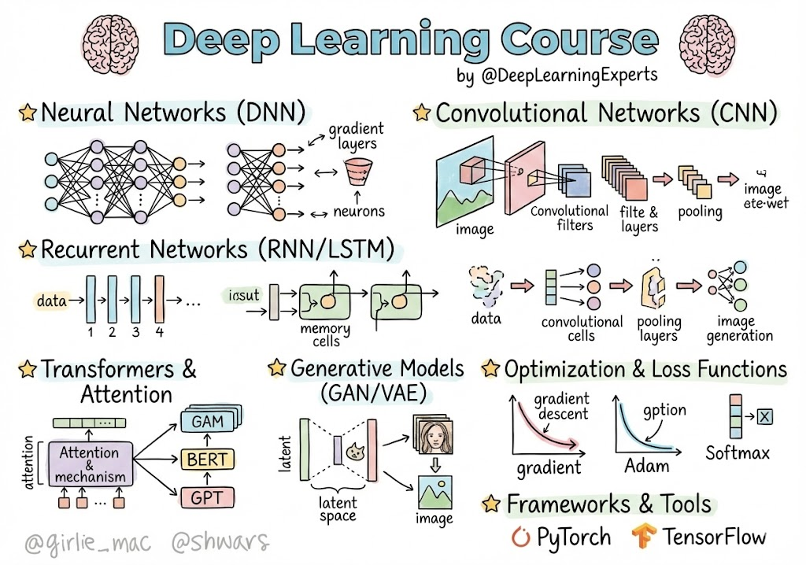

# SI7011 — Deep Learning

**Course repository for SI7011 — Deep Learning at Universidad EAFIT**

| **Instructor** | Juan David Martínez Vargas — jdmartinev@eafit.edu.co |
|---|---|

<p align="center">
  
</p>

<p align="center"><em>Deep Learning overview illustration. Original credits are shown in the image.</em></p>

## Course overview

This course develops a practical and conceptual understanding of **deep learning**, from the mechanics of learning with gradient-based optimization to modern pretrained and foundation models.

The course is organized around six questions:

[
\text{learn}
\rightarrow
\text{train}
\rightarrow
\text{structure}
\rightarrow
\text{represent}
\rightarrow
\text{pretrain}
\rightarrow
\text{adapt / evaluate / deploy}
]

## We will learn in this course

- **Learning fundamentals:** parameterized models, loss functions, gradient descent, multilayer perceptrons, backpropagation, and automatic differentiation.
- **Training deep networks:** initialization, activation functions, SGD/Adam, regularization, normalization, residual connections, and training diagnostics.
- **Deep learning for vision:** convolutional neural networks, residual networks, transfer learning, attention, and **Vision Transformers (ViT)**.
- **Representation learning:** encoders and decoders, autoencoders, masked prediction, contrastive learning, embeddings, and self-supervised learning.
- **Sequential and foundation models:** RNNs, LSTM/GRU, attention, Transformers, pretraining, scaling, and foundation models for language, vision, time series, and tabular data.
- **Adaptation and deployment:** feature extraction, fine-tuning, PEFT/LoRA, distillation, quantization, distribution shift, evaluation, inference, and deployment.
- **Hands-on implementation:** using **PyTorch** and **Google Colab** to build, train, inspect, adapt, and evaluate deep learning models.

## Course structure

| Session | Guiding question | Main topics |
|---|---|---|
| **01 — Learning** | How does a neural network learn? | Model, loss, gradient descent, MLP, backprop, autograd |
| **02 — Deep Training** | Why can we train deep neural networks? | Initialization, optimization, normalization, residual learning, generalization |
| **03 — Architectures for Vision** | How does data structure shape the network? | CNN, ResNet, transfer learning, attention, ViT |
| **04 — Representation Learning** | How can a network learn without explicit labels? | Autoencoders, masked modeling, contrastive learning, SSL |
| **05 — Sequences & Foundation Models** | How do models learn context at scale? | RNN, LSTM/GRU, Transformer, pretraining, scaling, foundation models |
| **06 — Adaptation, Evaluation & Deployment** | How do we turn pretrained models into reliable applications? | Fine-tuning, PEFT, OOD, evaluation, inference, quantization, deployment |

Detailed course design: [`course/course_structure.md`](course/course_structure.md)

## Session 01 — Learning

The first session is already under active development:

- [Marp slide deck](sessions/01_learning/slides/S01_slides.marp.md)
- [Figure production list](sessions/01_learning/figures/figures.md)
- [Notebook plan](sessions/01_learning/notebooks/README.md)

The central mental model is:

[
x
\rightarrow
f_\theta(x)
\rightarrow
\hat y
\rightarrow
\mathcal L
\rightarrow
\nabla_\theta \mathcal L
\rightarrow
\theta'
]

## Evaluation

| Assessment item | Percentage |
|---|---:|
| Laboratory I — Basics | 16.25% |
| Laboratory II — CNNs and Transfer Learning | 16.25% |
| Laboratory III — RNNs | 16.25% |
| Laboratory IV — Transformers | 16.25% |
| **Final Project** | **35%** |

## Repository structure

```text
SI7011-DeepLearning/
├── README.md
├── assets/
│   └── DL.jpg
├── course/
│   └── course_structure.md
├── sessions/
│   ├── 01_learning/
│   │   ├── slides/
│   │   ├── figures/
│   │   └── notebooks/
│   ├── 02_deep_training/
│   ├── 03_vision/
│   ├── 04_representation_learning/
│   ├── 05_foundation_models/
│   └── 06_adaptation_deployment/
├── assignments/
└── references/
```

Slides are primarily authored in **Marp**. Practical material is developed in **PyTorch/Colab**, and figures are treated as reusable teaching assets rather than decoration.

## Computational resources

Free accounts are recommended on:

- [Google Colab](https://colab.research.google.com/)
- [Hugging Face](https://huggingface.co/)
- [Kaggle](https://www.kaggle.com/)
- [Lightning AI](https://lightning.ai/)
- [Weights & Biases](https://wandb.ai/site)

## Books

- [Deep Learning — Goodfellow, Bengio & Courville](https://www.deeplearningbook.org/)
- [Dive into Deep Learning](https://d2l.ai/)
- [Deep Learning: Foundations and Concepts — Bishop & Bishop](https://www.bishopbook.com/)
- [Deep Learning with Python — François Chollet](https://github.com/fchollet/deep-learning-with-python-notebooks)
- [The Little Book of Deep Learning — François Fleuret](https://fleuret.org/francois/lbdl.html)

## Reference courses

- [MIT 6.7960 — Deep Learning](https://deeplearning6-7960.github.io/)
- [MIT Introduction to Deep Learning](https://introtodeeplearning.com/)
- [François Fleuret — Deep Learning Course](https://fleuret.org/dlc/)
- [DeepMind Deep Learning Course](https://www.youtube.com/watch?v=7R52wiUgxZI)

## Design philosophy

The course does not treat deep learning as a catalog of architectures. Each session starts from a **problem or question**, develops the mathematical and computational ideas needed to address it, and then validates those ideas experimentally.

For the visual material, the guiding principle is:

> **one main conceptual transformation per slide**

Figures, animations, equations, and code are introduced only when they make that transformation easier to understand.
