# How does a neural network learn?

<div class="center">

$$
x \longrightarrow f_\theta(x) \longrightarrow \hat y
\longrightarrow L
\longrightarrow \nabla_\theta L
\longrightarrow \theta'
$$

</div>

---

<!-- _class: figure -->
<!-- _paginate: false -->
<!-- _footer: "" -->


---

# We observe data

$$
\mathcal D=\{(x_i,y_i)\}_{i=1}^{N}
$$

We start from **observed examples**, not from explicit rules.

---

<!-- _class: figure -->
<!-- _paginate: false -->
<!-- _footer: "" -->


---

# The input

$$
x
$$

The information available **before** making a prediction.

- tabular attributes
- images
- sequences
- signals

<!-- Pending visual: VISUAL — multiple data modalities converging to $x$ -->

---

# The target

$$
y
$$

The value or class we want to predict.

$$
(x,y)
$$

The target is combined with the prediction to compute the loss during training.

<!-- Pending visual: VISUAL — input $x$ and target $y$ as an observed pair -->

---

# A model

$$
f_\theta
$$

A model is a **parameterized function**.

$$
x \longrightarrow \boxed{f_\theta} \longrightarrow ?
$$

<!-- Pending visual: FIGURE S01-F03 — Data → model -->

---

# Prediction

$$
\hat y=f_\theta(x)
$$

Inference means using the **current parameters** to produce an output.

<!-- Pending visual: VISUAL — $x \rightarrow f_\theta(x) \rightarrow \hat y$ -->

---

# Is the prediction good?

$$
y \qquad\qquad \hat y
$$

How do we transform the quality of a prediction into something we can optimize?


---

# Loss

$$
L(y,\hat y)
$$

For regression, one possibility is:

$$
L=(y-\hat y)^2
$$

A loss converts the task objective into a **scalar quantity**.


---

# Loss depends on the parameters

$$
\hat y=f_\theta(x)
$$

therefore,

$$
L(y,\hat y)
=
L(y,f_\theta(x))
$$

and we can reason about:

$$
L(\theta)
$$

---

<!-- _class: media -->

# Parameters, residuals and loss

<video controls preload="none" poster="../figures/s01_e1_poster.png" aria-label="Parameters, residuals and loss">
  <source src="../figures/E1_ParametrosPerdida.mp4" type="video/mp4">
</video>
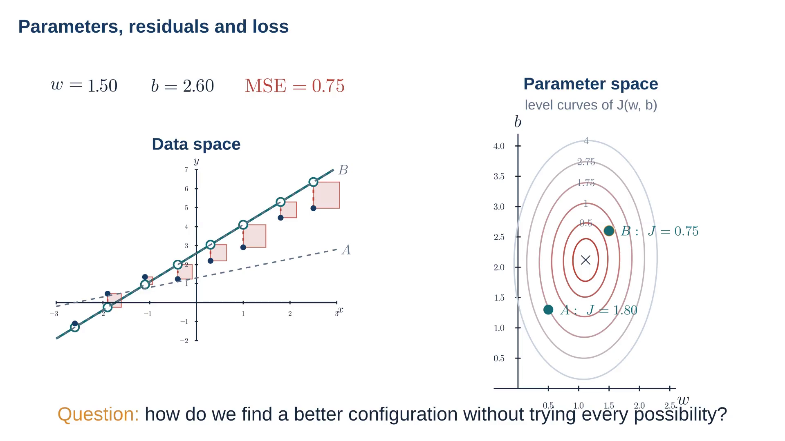

[Open animation](../figures/E1_ParametrosPerdida.mp4)

<!-- Predict before each step: how w and b move the line, why residuals are vertical, and how the MSE changes. J(w, b) is the dataset average, formalized later. -->

---

<!-- _class: figure -->
<!-- _paginate: false -->
<!-- _footer: "" -->


---

<!-- _class: figure -->
<!-- _paginate: false -->
<!-- _footer: "" -->

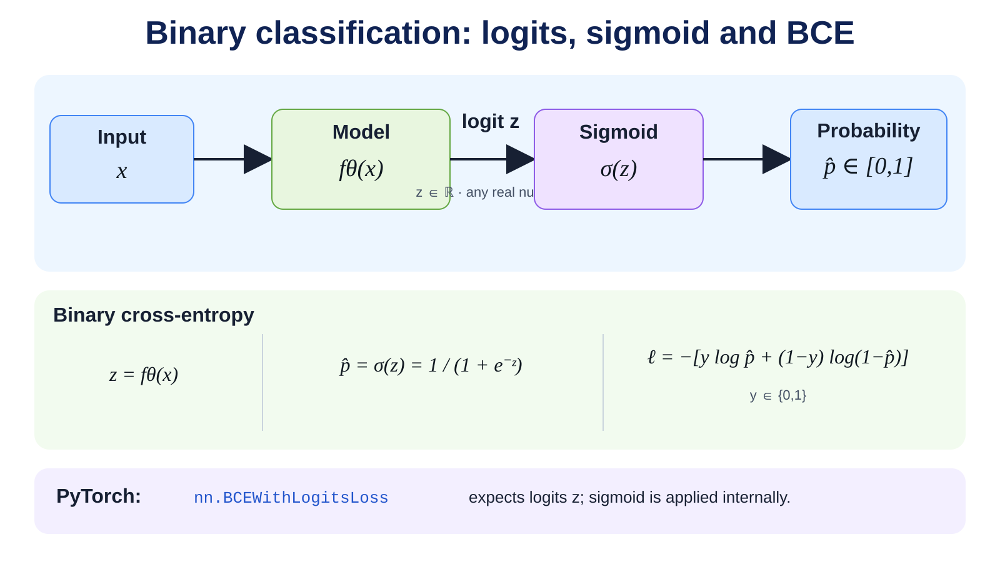

---

<!-- _class: figure -->
<!-- _paginate: false -->
<!-- _footer: "" -->

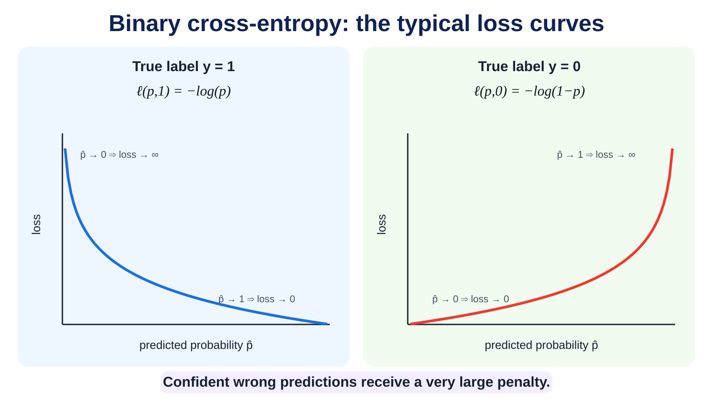

---

<!-- _class: media -->

# From score to probability to loss

<video controls preload="none" poster="../figures/s01_e2_poster.png" aria-label="From score to probability to loss">
  <source src="../figures/E2_PuntajeProbabilidad.mp4" type="video/mp4">
</video>
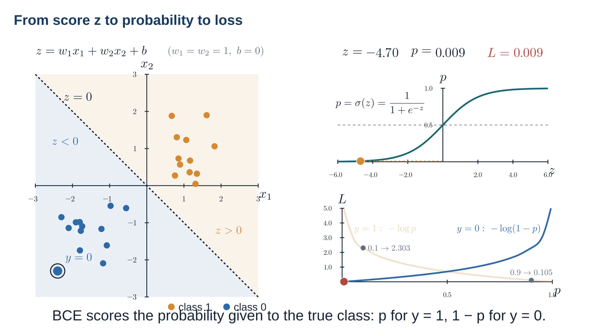

[Open animation](../figures/E2_PuntajeProbabilidad.mp4)

<!-- Ask whether z is a probability, then what happens to the loss for a confident error and when the true label flips. -->

---

<!-- _class: figure -->
<!-- _paginate: false -->
<!-- _footer: "" -->

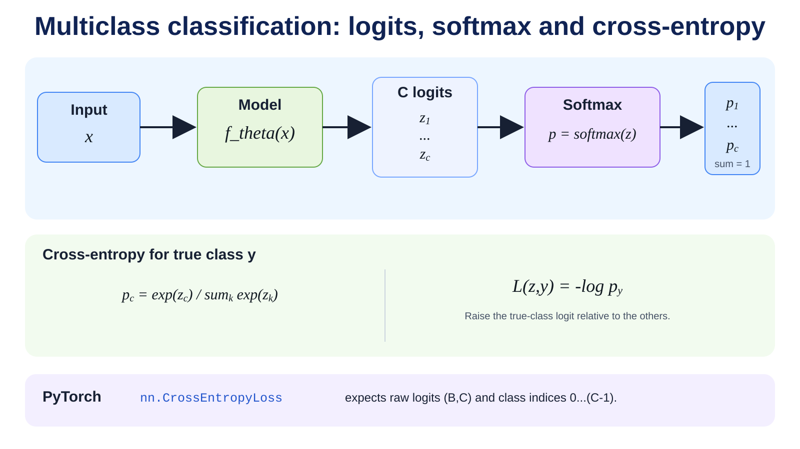

---

<!-- _class: figure -->
<!-- _paginate: false -->
<!-- _footer: "" -->

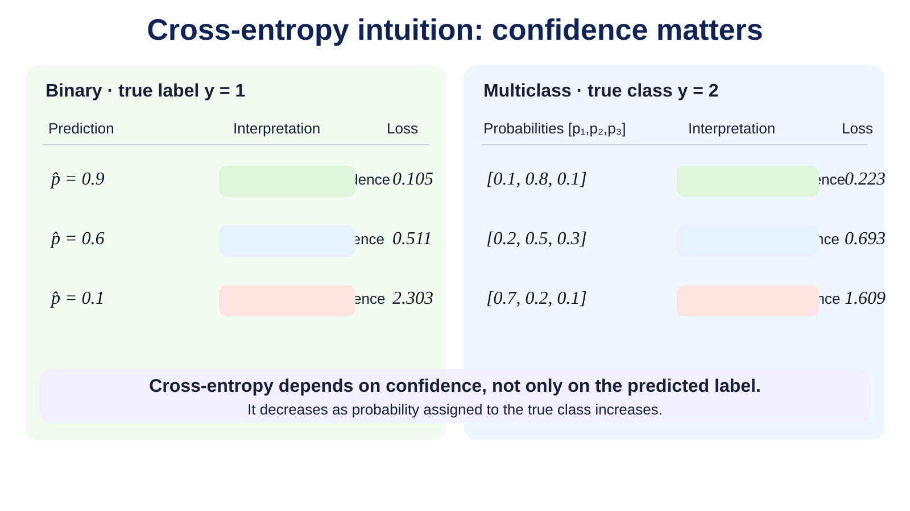

---

<!-- _class: figure -->
<!-- _paginate: false -->
<!-- _footer: "" -->

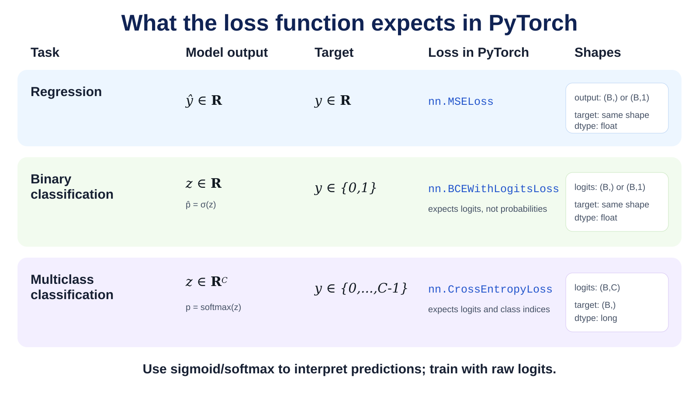

---

# Training is not inference

| Inference | Training |
|---|---|
| $x \rightarrow f_\theta(x)\rightarrow \hat y$ | $(x,y)\rightarrow f_\theta(x)\rightarrow\hat y\rightarrow L\rightarrow\theta'$ |
| parameters are **used** | parameters are **changed** |

---

<!-- _class: figure -->
<!-- _paginate: false -->
<!-- _footer: "" -->

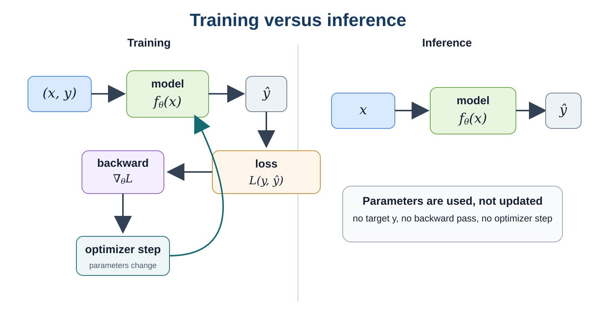

---

# One parameter

Suppose:

$$
\hat y = wx
$$

Changing $w$ changes the prediction and therefore changes the loss.


---

# The gradient

$$
\frac{\partial L}{\partial w}
$$

The gradient gives **local information** about how the loss changes.

---

<!-- _class: figure -->
<!-- _paginate: false -->
<!-- _footer: "" -->


---

# Gradient descent

$$
w_{t+1}
=
w_t-\eta
\frac{\partial L}{\partial w}
$$

Two ingredients:

- **direction** from the gradient
- **step size** from the learning rate


---

<!-- _class: media -->

# Derivative, gradient and update

<video controls preload="none" poster="../figures/s01_e3_poster.png" aria-label="Derivative, gradient and update">
  <source src="../figures/E3_DescensoGradiente.mp4" type="video/mp4">
</video>
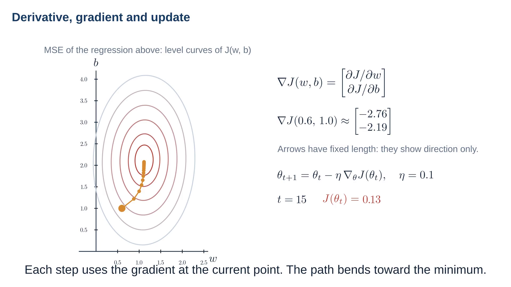

[Open animation](../figures/E3_DescensoGradiente.mp4)

<!-- Exact steps on L(w) = (w-3)^2 with eta = 0.1: 1 -> 1.4 -> 1.72. The last part previews the gradient in two parameters on the level curves of J(w, b). -->

---

# Learning rate

$$
\eta
$$

What changes if the step is:

- too small?
- appropriate?
- too large?


---

<!-- _class: media -->

# Comparing learning rates

<video controls preload="none" poster="../figures/s01_e4_poster.png" aria-label="Comparing learning rates">
  <source src="../figures/E4_TasaAprendizaje.mp4" type="video/mp4">
</video>
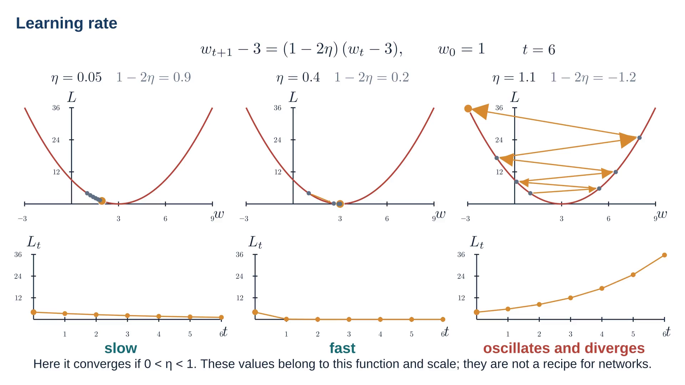

[Open animation](../figures/E4_TasaAprendizaje.mp4)

<!-- Same parabola and same w_0: eta = 0.05, 0.4 and 1.1. Ask students to predict each behavior first. -->

---

# More than one parameter

$$
\theta=(w_1,w_2,\ldots,w_p)
$$

$$
\nabla_\theta L
=
\begin{bmatrix}
\partial L/\partial w_1\\
\vdots\\
\partial L/\partial w_p
\end{bmatrix}
$$


---

# From example loss to dataset objective

For one observation:

$$
L_i(\theta)=L\!\left(y_i,f_\theta(x_i)\right)
$$

For the full dataset:

$$
J(\theta)
=
\frac{1}{N}
\sum_{i=1}^{N}
L_i(\theta)
$$

**Convention:** $L$ is a per-example loss; $J$ is the dataset objective.

---

<!-- _class: media -->

# Each parameter is a knob

<video controls preload="none" poster="../figures/s01_e11_poster.png" aria-label="Each parameter is a knob">
  <source src="../figures/E11_PerillasGradiente.mp4" type="video/mp4">
</video>
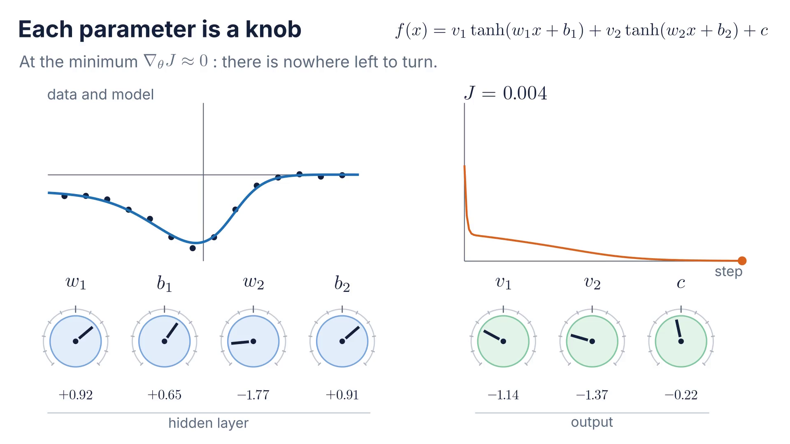

[Open animation](../figures/E11_PerillasGradiente.mp4)

<!-- Each component of the gradient tells one knob which way to turn. Real gradient descent with eta = 0.2 on J. -->

---

# Batch, SGD and mini-batch

For a subset $\mathcal B$:

$$
J_{\mathcal B}(\theta)
=
\frac{1}{|\mathcal B|}
\sum_{i\in\mathcal B}
L_i(\theta)
$$

- **batch:** $\mathcal B=\mathcal D$
- **SGD:** $|\mathcal B|=1$
- **mini-batch:** $1<|\mathcal B|<N$

The update uses $g_t=\nabla_\theta J_{\mathcal B_t}(\theta_t)$.

<!-- Pending visual: FIGURE S01-F10 — Batch / SGD / mini-batch -->

---

# Optimization is a trajectory

$$
\theta_{t+1}=\theta_t-\eta g_t
$$

$$
\theta_0,\theta_1,\theta_2,\ldots
$$

Training moves through parameter space using successive gradient estimates.

---

# What can a linear model represent?

Optimization can work perfectly while the model still lacks enough capacity.

<!-- Pending visual: FIGURE S01-F11 — Linear vs nonlinear structure -->

---

# Stacking linear transformations

$$
h=W_1x+b_1
$$

$$
\hat y=W_2h+b_2
$$

Therefore:

$$
\hat y=W_2W_1x+W_2b_1+b_2
$$

Several linear layers can collapse into a single affine transformation.

---

# Nonlinearity changes the game

$$
z=Wx+b,\qquad a=\phi(z)
$$

A nonlinear activation prevents the composition from collapsing into one linear map.


---

<!-- _class: media -->

# Why we need an activation

<video controls preload="none" poster="../figures/s01_e5_poster.png" aria-label="Why we need an activation">
  <source src="../figures/E5_Activacion.mp4" type="video/mp4">
</video>
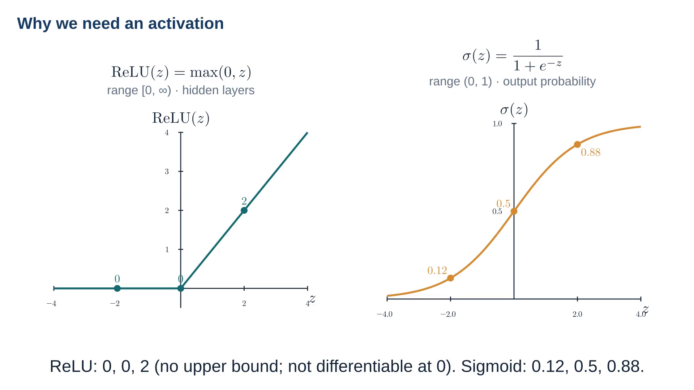

[Open animation](../figures/E5_Activacion.mp4)

<!-- First the weighted sum of lines collapses to another line; then ReLU adds breakpoints at x = -b_1j / w_1j. -->

---

<!-- _class: media -->

# Affine maps and nonlinear activations

<video controls preload="none" poster="../figures/s01_transformation_overview.png" aria-label="Affine maps and nonlinear activations">
  <source src="../figures/E9_EjemploActivaciones.mp4" type="video/mp4">
</video>
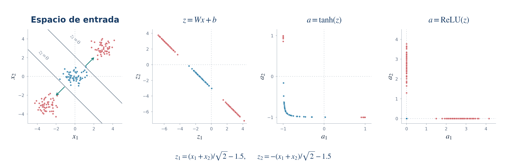

[Open animation](../figures/E9_EjemploActivaciones.mp4)

<!-- Compare input coordinates, the affine transformation, tanh and ReLU. Which representations allow a linear separator? -->

---

# ReLU

$$
\operatorname{ReLU}(z)=\max(0,z)
$$

A very simple nonlinear function can become a powerful building block.


---

# One ReLU as a building block

A single unit produces a simple piecewise-linear transformation.

<!-- Pending visual: VISUAL — one shifted/scaled ReLU component -->

---

<!-- _class: figure -->
<!-- _paginate: false -->
<!-- _footer: "" -->

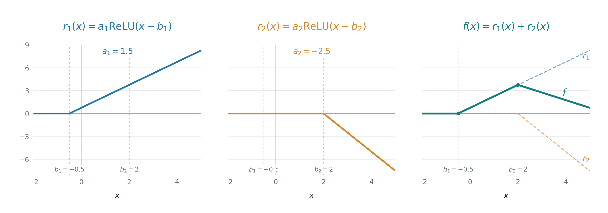

---

<!-- _class: media -->

# Approximation with ReLU components

<video controls preload="none" poster="../figures/s01_f12_two_relu_components.png" aria-label="Approximation with ReLU components">
  <source src="../figures/E7_AproximacionReLU.mp4" type="video/mp4">
</video>


[Open animation](../figures/E7_AproximacionReLU.mp4)

<!-- As the number of components grows, identify the new breakpoints. This animation changes capacity, without training parameters. -->

---

# A hidden layer

$$
z_1=W_1x+b_1,\qquad a_1=\phi(z_1)
$$

$$
\hat y=W_2a_1+b_2
$$

A hidden layer learns an **intermediate representation**.


---

<!-- _class: media -->

# Hidden representation and decision boundary

<video controls preload="none" poster="../figures/s01_e6_poster.png" aria-label="Hidden representation and decision boundary">
  <source src="../figures/E6_TransformacionEspacio.mp4" type="video/mp4">
</video>
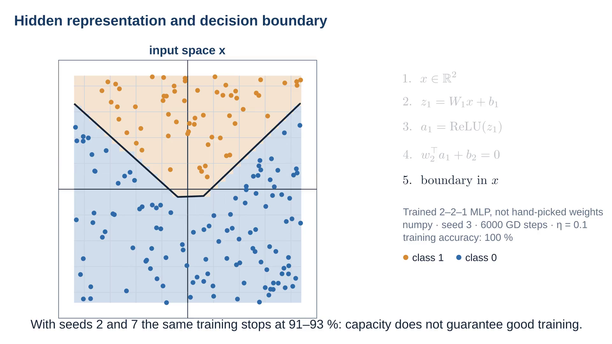

[Open animation](../figures/E6_TransformacionEspacio.mp4)

<!-- Trained 2-2-1 MLP: affine map, ReLU fold, one line in a_1, and the V-shaped boundary back in x. -->

---

<!-- _class: figure -->
<!-- _paginate: false -->
<!-- _footer: "" -->

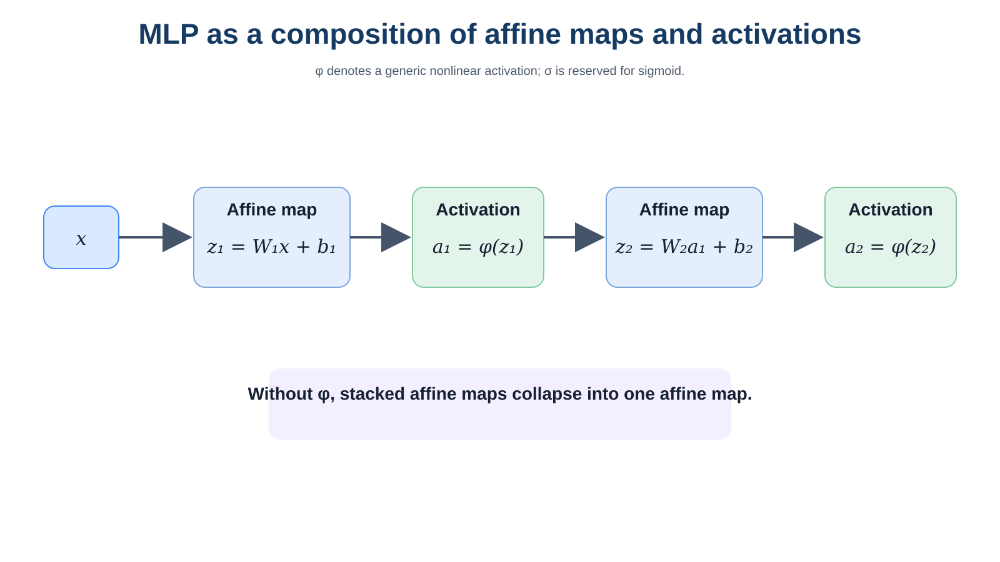

---

<!-- _class: media -->

# Each layer transforms the space

<video controls preload="none" poster="../figures/s01_e8_poster.png" aria-label="Each layer transforms the space">
  <source src="../figures/E8_CapasTransformanEspacio.mp4" type="video/mp4">
</video>
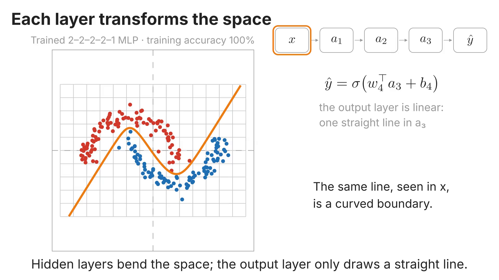

[Open animation](../figures/E8_CapasTransformanEspacio.mp4)

<!-- Trained 2-2-2-2-1 tanh MLP on two moons. Each layer bends the space until one line separates the classes. -->

---

# Forward pass

$$
x
\rightarrow
z_1
\rightarrow
a_1
\rightarrow
z_2
\rightarrow
a_2
\rightarrow
\hat y
\rightarrow
L
$$

The forward pass evaluates the composed function.

<!-- Pending visual: VISUAL — values propagating left → right -->

---

# Computational graph

Each hidden layer contains an affine map and an activation:

$$
z_l=W_la_{l-1}+b_l,\qquad a_l=\phi(z_l),\qquad a_0=x
$$

For a linear output and squared loss:

$$
\hat y=W_3a_2+b_3,\qquad L=\frac{1}{2}\lVert\hat y-y\rVert^2
$$

---

<!-- _class: figure -->
<!-- _paginate: false -->
<!-- _footer: "" -->

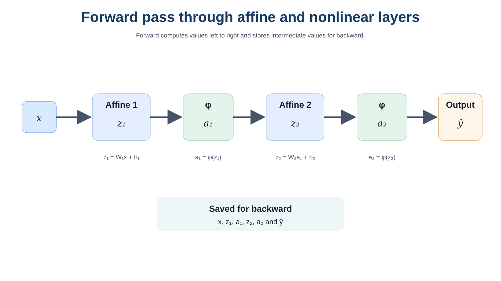

---

# Chain rule

If:

$$
L=L(\hat y(a(w)))
$$

then:

$$
\frac{\partial L}{\partial w}
=
\frac{\partial L}{\partial \hat y}
\frac{\partial \hat y}{\partial a}
\frac{\partial a}{\partial w}
$$

<!-- Pending visual: VISUAL — equation aligned with computational graph -->

---

# Backward pass

The same graph is traversed in the opposite direction to propagate gradients.

---

<!-- _class: figure -->
<!-- _paginate: false -->
<!-- _footer: "" -->

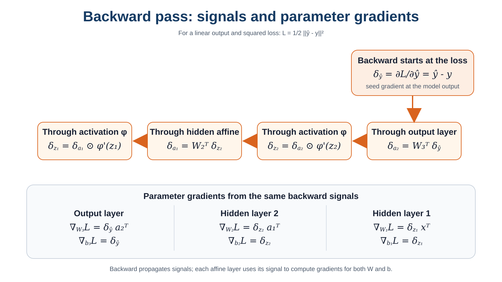

---

<!-- _class: media -->

# Forward values and backward signals

<video controls preload="none" poster="../figures/s01_f14_computational_graph_forward.svg" aria-label="Forward values and backward signals">
  <source src="../figures/E10_GrafoForwardBackward.mp4" type="video/mp4">
</video>


[Open animation](../figures/E10_GrafoForwardBackward.mp4)

<!-- Follow the stored values during forward. During backward, identify each local rule: δ for intermediate signals, ∇L for parameter gradients. -->

---

# Gradients for every parameter

Each trainable parameter receives:

$$
\frac{\partial L}{\partial w_i}
$$

The backward pass produces the information required by the optimizer.

<!-- Pending visual: VISUAL — parameter nodes annotated with local gradients -->

---

# Backpropagation is not gradient descent

| Backpropagation | Optimizer |
|---|---|
| computes $\nabla_\theta J_{\mathcal B}$ | uses $\nabla_\theta J_{\mathcal B}$ |
| differentiates the graph | updates the parameters |

$$
\text{backward} \neq \text{update}
$$

---

# Automatic differentiation

Manual view:

$$
\text{operations}
\rightarrow
\text{local derivatives}
\rightarrow
\text{chain rule}
$$

PyTorch:

```python
loss.backward()
```

Autograd automates differentiation of the computational graph.

---

# The PyTorch training loop

```python
optimizer.zero_grad()

y_hat = model(x)
loss = criterion(y_hat, y)

loss.backward()
optimizer.step()
```

---

<!-- _class: figure -->
<!-- _paginate: false -->
<!-- _footer: "" -->


---

<!-- _class: figure -->
<!-- _paginate: false -->
<!-- _footer: "" -->

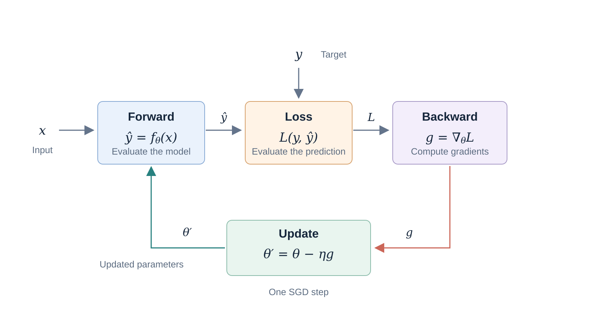

---

# What changes in deep learning?

The learning loop remains the same.

What changes is:

- $f_\theta$
- architecture
- loss
- optimizer
- data
- scale

CNNs, RNNs, ViTs and Transformers do **not** replace the learning loop.

---

# Exit question

A student says:

> “Backpropagation updates the weights to minimize the loss.”

What is incorrect in that statement?

---

# Guided practice — PyTorch in one hour

[Open notebook](../notebooks/sesion_01_pytorch_60min.ipynb)

- tensors and affine transformations
- scalar autograd and parameter updates
- `TensorDataset` and `DataLoader`
- MLP for nonlinear classification
- loss curves and decision boundaries

> Predict the behavior before running each experiment.

---

# Exercise — Multiclass MLP with tabular data

[Open notebook](../notebooks/sesion_01_ejercicio_mlp_multiclase_kaggle.ipynb)

Dry Bean dataset from Kaggle: 16 attributes and 7 classes.

- split and standardize the data
- create a `DataLoader`
- implement an MLP and the training loop
- use `CrossEntropyLoss`
- evaluate accuracy, macro F1 and the confusion matrix

---

# Session 01 — Mental model

$$
\boxed{
\text{forward}
\rightarrow
\text{loss}
\rightarrow
\text{backward}
\rightarrow
\text{update}
}
$$

If this loop is clear, the rest of the course has a common foundation.
