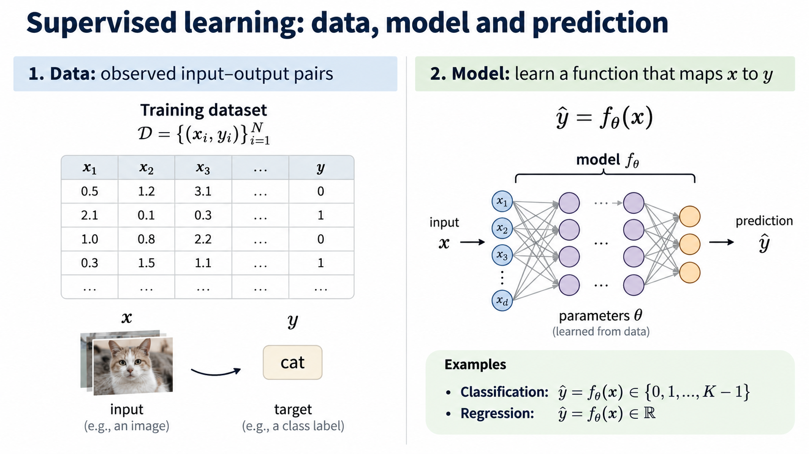
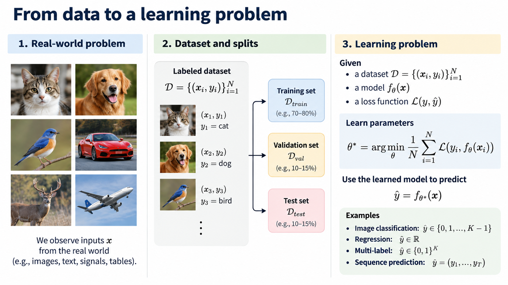
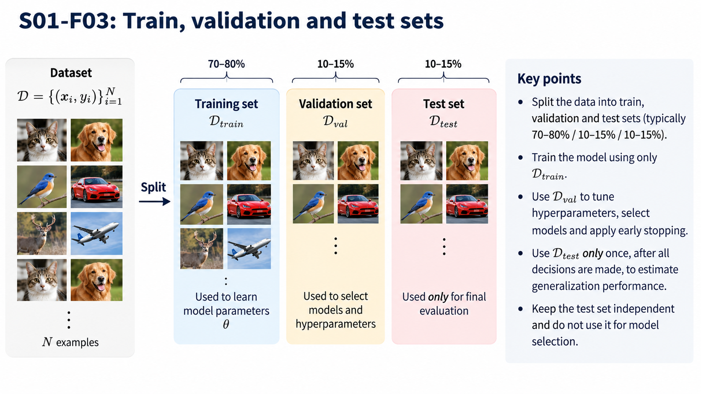
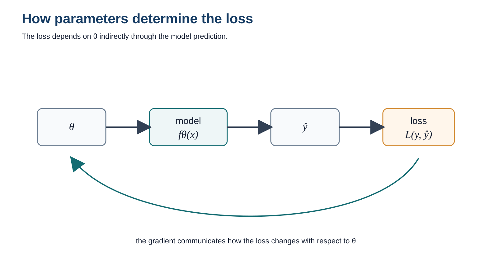
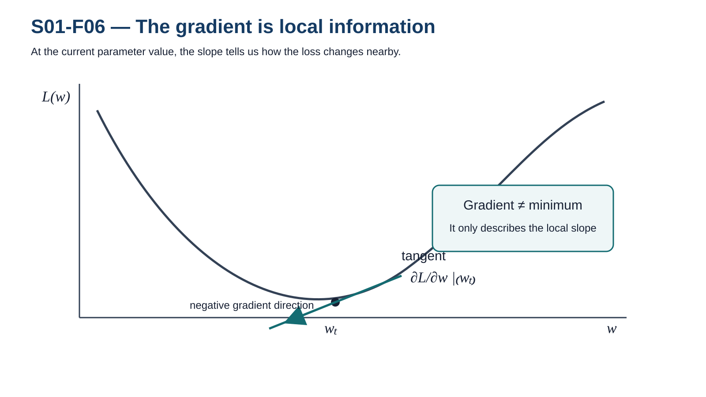
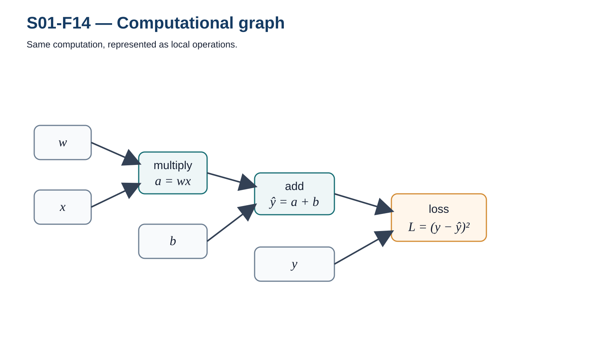
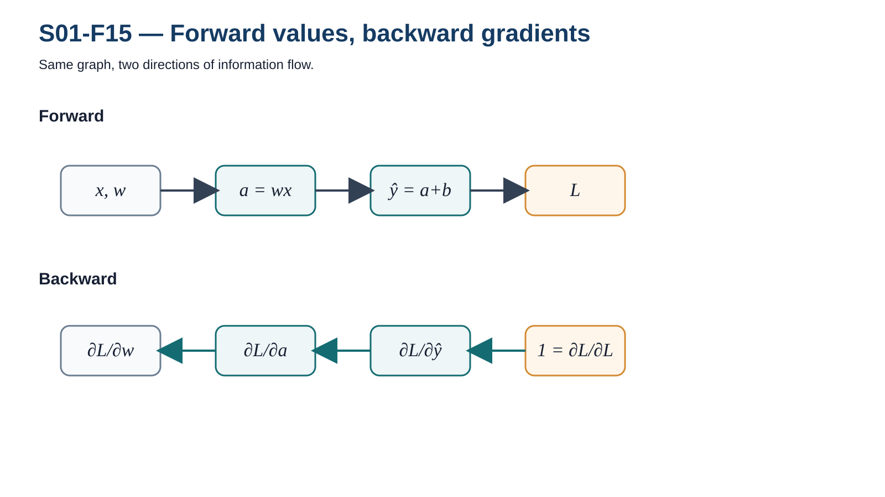
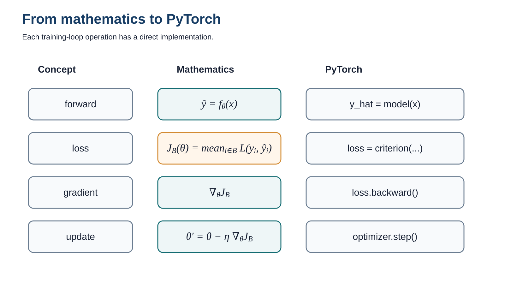

# How does a neural network learn?

<div class="center">

$
x \longrightarrow f_\theta(x) \longrightarrow \hat y
\longrightarrow \mathcal L
\longrightarrow \nabla_\theta
\longrightarrow \theta'
$

</div>

---

<!-- _class: figure -->
<!-- _paginate: false -->
<!-- _footer: "" -->



---

# We observe data

$
\mathcal D=\{(x_i,y_i)\}_{i=1}^{N}
$

We start from **observed examples**, not from explicit rules.

---

<!-- _class: figure -->
<!-- _paginate: false -->
<!-- _footer: "" -->



---

<!-- _class: figure -->
<!-- _paginate: false -->
<!-- _footer: "" -->



---

# The input

$
x
$

The information available **before** making a prediction.

- tabular attributes
- images
- sequences
- signals

<div class="placeholder">
VISUAL — multiple data modalities converging to \(x\)
</div>

---

# The target

$
y
$

The value or class we want to predict.

$
(x,y)
$

The target is used to evaluate the prediction during training.

<div class="placeholder">
VISUAL — input \(x\) and target \(y\) as an observed pair
</div>

---

# A model

$
f_\theta
$

A model is a **parameterized function**.

$
x \longrightarrow \boxed{f_\theta} \longrightarrow ?
$

<div class="placeholder">
FIGURE S01-F03 — Data → model
</div>

---

# Prediction

$
\hat y=f_\theta(x)
$

Inference means using the **current parameters** to produce an output.

<div class="placeholder">
VISUAL — \(x \rightarrow f_\theta(x) \rightarrow \hat y\)
</div>

---

# Training is not inference

| Inference | Training |
|---|---|
| \(x \rightarrow f_\theta(x)\rightarrow \hat y\) | \((x,y)\rightarrow f_\theta(x)\rightarrow\hat y\rightarrow\mathcal L\rightarrow\theta'\) |
| parameters are **used** | parameters are **changed** |

---

<!-- _class: figure -->
<!-- _paginate: false -->
<!-- _footer: "" -->


---

# Is the prediction good?

$
y \qquad\qquad \hat y
$

How do we transform the quality of a prediction into something we can optimize?

<div class="placeholder">
VISUAL — target and prediction separated by an explicit error gap
</div>

---

# Loss

$
\mathcal L(y,\hat y)
$

For regression, one possibility is:

$
\mathcal L=(y-\hat y)^2
$

A loss converts the task objective into a **scalar quantity**.

<div class="placeholder">
VISUAL — prediction and target on a line with squared error
</div>

---

# Loss depends on the parameters

$
\hat y=f_\theta(x)
$

therefore,

$
\mathcal L(y,\hat y)
=
\mathcal L(y,f_\theta(x))
$

and we can reason about:

$
\mathcal L(\theta)
$

---

<!-- _class: figure -->
<!-- _paginate: false -->
<!-- _footer: "" -->



---

# One parameter

Suppose:

$
\hat y = wx
$

Changing \(w\) changes the prediction and therefore changes the loss.

<div class="placeholder">
VISUAL — curve \(L(w)\) with current parameter \(w_t\)
</div>

---

# The gradient

$
\frac{\partial \mathcal L}{\partial w}
$

The gradient gives **local information** about how the loss changes.

---

<!-- _class: figure -->
<!-- _paginate: false -->
<!-- _footer: "" -->



---

# Gradient descent

$
w_{t+1}
=
w_t-\eta
\frac{\partial \mathcal L}{\partial w}
$

Two ingredients:

- **direction** from the gradient
- **step size** from the learning rate

<div class="placeholder">
VISUAL — one optimization step on \(L(w)\)
</div>

---

# Learning rate

$
\eta
$

What changes if the step is:

- too small?
- appropriate?
- too large?

<div class="placeholder">
FIGURE S01-F07 — Three learning rates
</div>

---

<!-- _class: figure -->
<!-- _paginate: false -->
<!-- _footer: "" -->


---

# More than one parameter

$
\theta=(w_1,w_2,\ldots,w_p)
$

$
\nabla_\theta\mathcal L
=
\begin{bmatrix}
\partial\mathcal L/\partial w_1\\
\vdots\\
\partial\mathcal L/\partial w_p
\end{bmatrix}
$

<div class="placeholder">
FIGURE S01-F08 — Loss surface
</div>

---

# Optimization is a trajectory

$
\theta_0,\theta_1,\theta_2,\ldots
$

Training moves through the parameter space.

---

<!-- _class: figure -->
<!-- _paginate: false -->
<!-- _footer: "" -->


---

# Dataset loss

For many observations:

$
J(\theta)
=
\frac{1}{N}
\sum_{i=1}^{N}
\mathcal L(y_i,f_\theta(x_i))
$

Optimizing one observation is not the same as learning the dataset.

---

# Batch, SGD and mini-batch

Three ways to estimate the gradient:

- all observations
- one observation
- a subset

<div class="placeholder">
FIGURE S01-F10 — Batch / SGD / mini-batch
</div>

---

# Practice A — Gradient descent from scratch

Notebook:

`S01_N01_gradient_descent.ipynb`

Goals:

1. implement \( \hat y=wx+b \)
2. compute MSE
3. derive gradients
4. update \(w,b\)
5. compare learning rates
6. compare full batch vs mini-batch

> Predict the behavior **before** running each experiment.

---

# What can a linear model represent?

Optimization can work perfectly while the model still lacks enough capacity.

<div class="placeholder">
FIGURE S01-F11 — Linear vs nonlinear structure
</div>

---

# Stacking linear transformations

$
h=W_1x+b_1
$

$
y=W_2h+b_2
$

Therefore:

$
y=W_2W_1x+W_2b_1+b_2
$

Several linear layers can collapse into a single affine transformation.

---

# Nonlinearity changes the game

$
h=\sigma(Wx+b)
$

A nonlinear activation prevents the composition from collapsing into one linear map.

<div class="placeholder">
VISUAL — insert a nonlinear transformation between two affine maps
</div>

---

# ReLU

$
\operatorname{ReLU}(z)=\max(0,z)
$

A very simple nonlinear function can become a powerful building block.

<div class="placeholder">
VISUAL — clean ReLU plot
</div>

---

# One ReLU as a building block

A single unit produces a simple piecewise-linear transformation.

<div class="placeholder">
VISUAL — one shifted/scaled ReLU component
</div>

---

# Add another ReLU

Two simple components already create a richer function.

<div class="placeholder">
FIGURE S01-F12A — Two ReLU components
</div>

---

# Approximation by composition

Adding several nonlinear components increases expressive capacity.

<div class="placeholder">
FIGURE S01-F12B — Progressive ReLU approximation
</div>

---

# A hidden layer

$
h=\sigma(W_1x+b_1)
$

$
\hat y=W_2h+b_2
$

A hidden layer learns an **intermediate representation**.

<div class="placeholder">
VISUAL — hidden units as learned features
</div>

---

# Multilayer perceptron

$
h_1=\sigma(W_1x+b_1)
$

$
h_2=\sigma(W_2h_1+b_2)
$

$
\hat y=W_3h_2+b_3
$

<div class="placeholder">
FIGURE S01-F13 — MLP as function composition
</div>

---

# Forward pass

$
x
\rightarrow
z_1
\rightarrow
h_1
\rightarrow
z_2
\rightarrow
\hat y
\rightarrow
\mathcal L
$

The forward pass evaluates the composed function.

<div class="placeholder">
VISUAL — values propagating left → right
</div>

---

# Computational graph

Example:

$
a=wx
$

$
\hat y=a+b
$

$
L=(y-\hat y)^2
$

---

<!-- _class: figure -->
<!-- _paginate: false -->
<!-- _footer: "" -->



---

# Chain rule

If:

$
L=L(\hat y(a(w)))
$

then:

$
\frac{\partial L}{\partial w}
=
\frac{\partial L}{\partial \hat y}
\frac{\partial \hat y}{\partial a}
\frac{\partial a}{\partial w}
$

<div class="placeholder">
VISUAL — equation aligned with computational graph
</div>

---

# Backward pass

The same graph is traversed in the opposite direction to propagate gradients.

---

<!-- _class: figure -->
<!-- _paginate: false -->
<!-- _footer: "" -->



---

# Gradients for every parameter

Each trainable parameter receives:

$
\frac{\partial L}{\partial w_i}
$

The backward pass produces the information required by the optimizer.

<div class="placeholder">
VISUAL — parameter nodes annotated with local gradients
</div>

---

# Backpropagation is not gradient descent

| Backpropagation | Optimizer |
|---|---|
| computes \(\nabla_\theta L\) | uses \(\nabla_\theta L\) |
| differentiates the graph | updates the parameters |

$
\text{backward} \neq \text{update}
$

---

# Automatic differentiation

Manual view:

$
\text{operations}
\rightarrow
\text{local derivatives}
\rightarrow
\text{chain rule}
$

PyTorch:

```python
loss.backward()
```

Autograd automates differentiation of the computational graph.

---

# The PyTorch training loop

```python
optimizer.zero_grad()

y_hat = model(x)
loss = criterion(y_hat, y)

loss.backward()
optimizer.step()
```

---

<!-- _class: figure -->
<!-- _paginate: false -->
<!-- _footer: "" -->



---

# The complete learning loop

$
x
\rightarrow
f_\theta(x)
\rightarrow
\hat y
\rightarrow
\mathcal L
\rightarrow
\nabla_\theta \mathcal L
\rightarrow
\theta'
$

<div class="placeholder">
FIGURE S01-F01 — Reprise, now fully annotated
</div>

---

# What changes in deep learning?

The learning loop remains the same.

What changes is:

- \(f_\theta\)
- architecture
- loss
- optimizer
- data
- scale

CNNs, RNNs, ViTs and Transformers do **not** replace the learning loop.

---

# Exit question

A student says:

> “Backpropagation updates the weights to minimize the loss.”

What is incorrect in that statement?

---

# Practice B — PyTorch without magic

Notebook:

`S01_N02_pytorch_autograd.ipynb`

- scalar autograd
- inspect `.grad`
- computational graph
- minimal MLP
- nonlinear 2D classification
- ablation: remove ReLU
- compare decision boundaries

---

# Session 01 — Mental model

$
\boxed{
\text{forward}
\rightarrow
\text{loss}
\rightarrow
\text{backward}
\rightarrow
\text{update}
}
$

If this loop is clear, the rest of the course has a common foundation.
