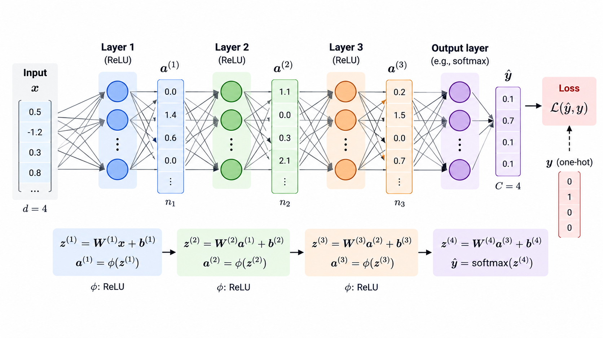
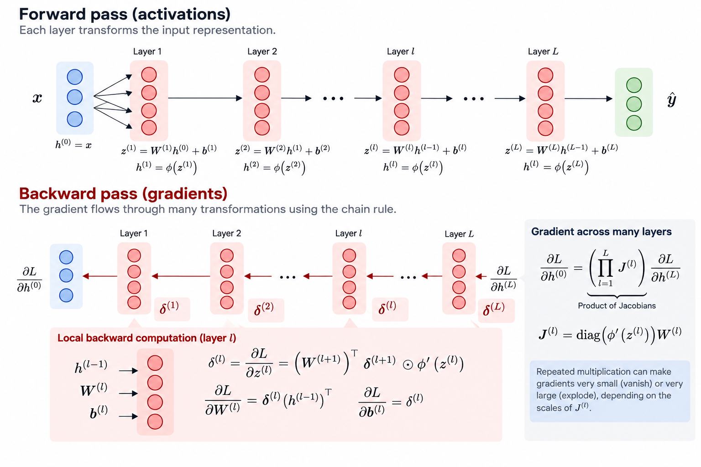
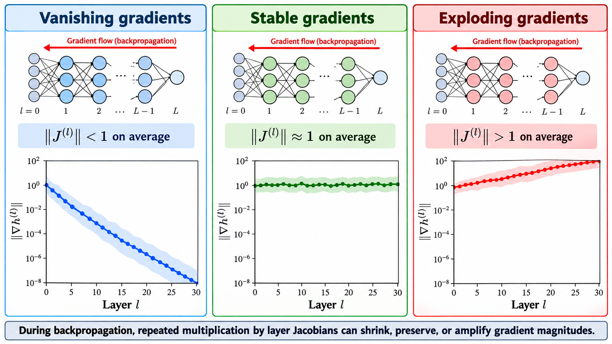
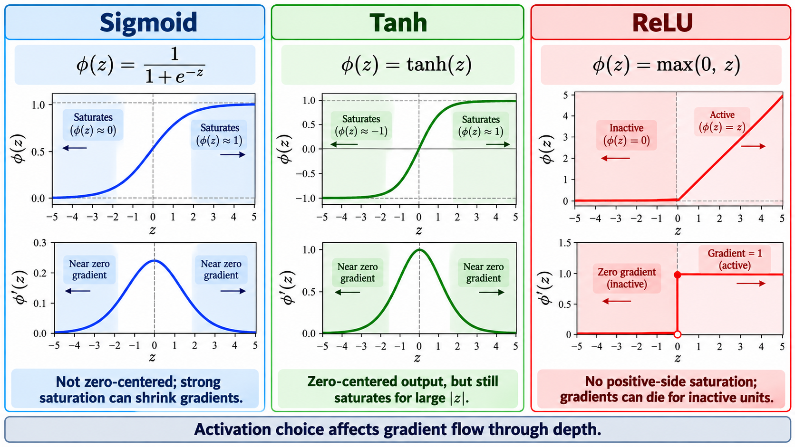
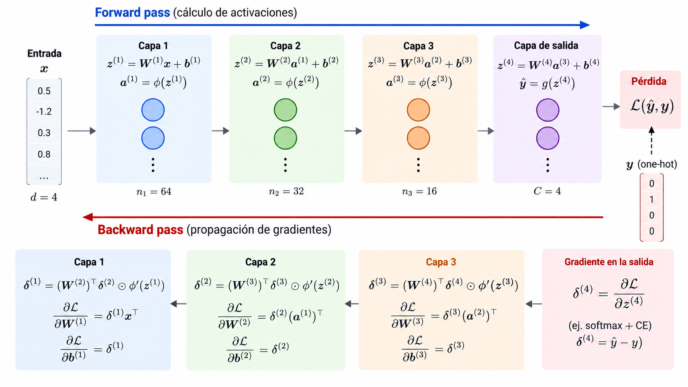
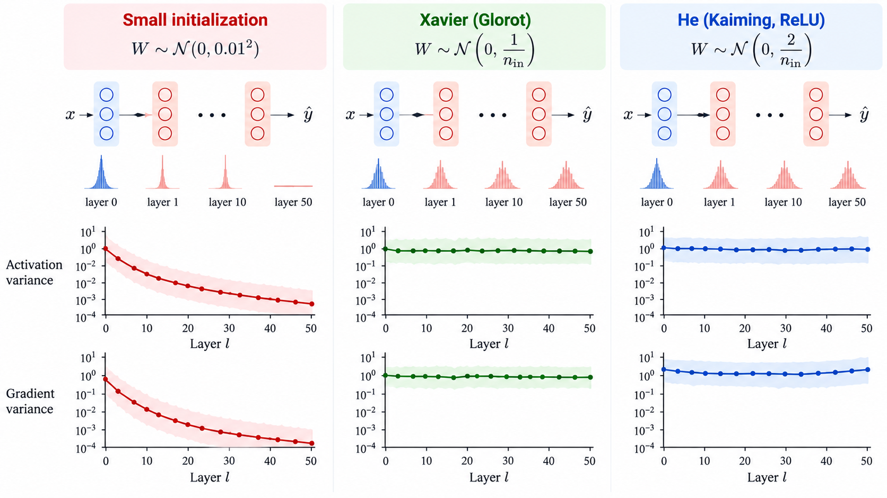
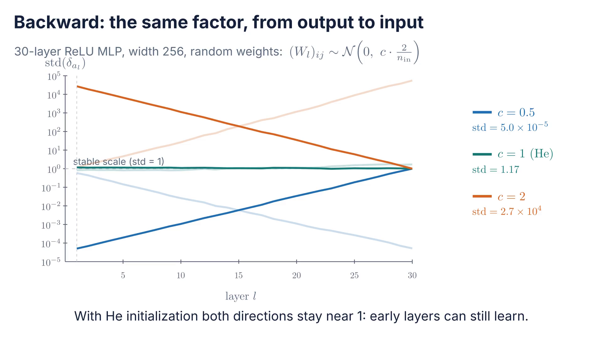
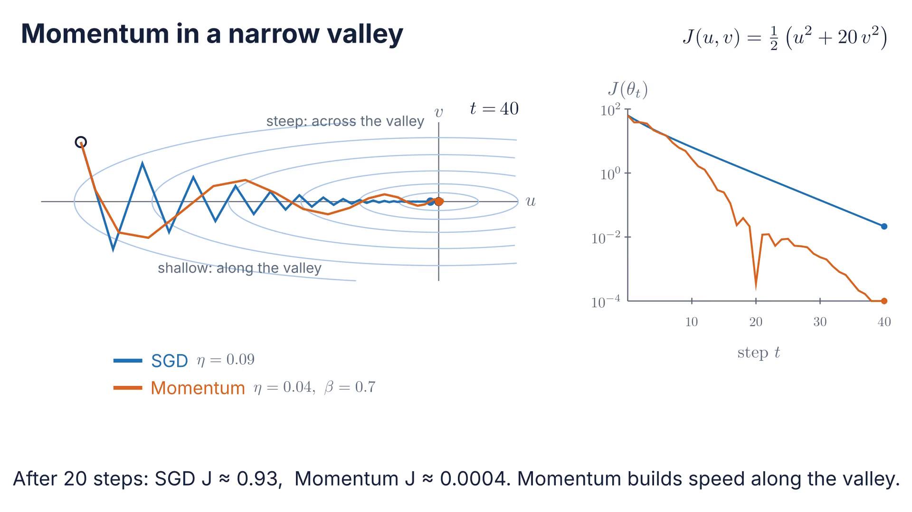
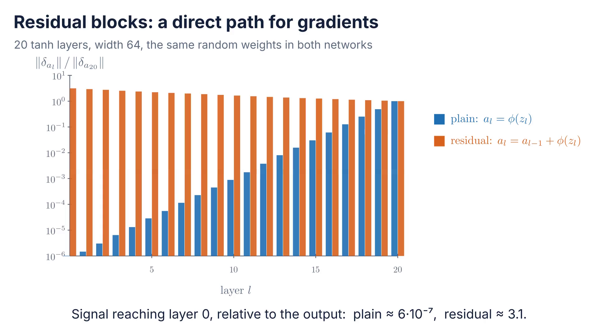

# Why can we train deep neural networks?

<div class="center">

$$
\text{depth}
\rightarrow
\text{stability}
\rightarrow
\text{optimization}
\rightarrow
\text{regularization}
\rightarrow
\text{residual learning}
$$

</div>

---

# Roadmap

1. Signal propagation — how scale moves through depth
2. Initialization — choosing the starting scale
3. Optimization — how gradients become steps
4. Normalization and regularization — stable scales and generalization
5. Residual learning and diagnostics — direct paths and debugging

Each part answers one reason why deep networks are hard to train, and one tool that fixes it.

---

# From learning to deep training

Session 01 established the learning loop:

$$
\text{forward}
\rightarrow
\text{loss}
\rightarrow
\text{backward}
\rightarrow
\text{update}
$$

Now we ask what happens when this loop is applied to **deep compositions**.

<!-- Pending figure: S02-F01 — From the single learning loop to a deep trainable system. -->

---

# The loop remains the same

The PyTorch loop does not change:

```python
optimizer.zero_grad()
y_hat = model(x)
loss = criterion(y_hat, y)
loss.backward()
optimizer.step()
```

What changes is the behavior of the model as depth increases.

---

# A deep network is a composition

For layer $l=1,\ldots,D$, with $a_0=x$:

$$
z_l=W_la_{l-1}+b_l,
\qquad
a_l=\phi(z_l)
$$

Therefore, for a network of depth $D$:

$$
f_\theta(x)
=
f_D\circ f_{D-1}\circ \cdots \circ f_1(x)
$$

Same notation as S01: $\phi$ is a generic activation, $L$ is the loss.

---

<!-- _class: figure -->
<!-- _paginate: false -->
<!-- _footer: "" -->



---

# Depth changes the training problem

Each layer transforms:

- the representation;
- the scale of activations;
- the direction and magnitude of gradients;
- the geometry seen by the optimizer.

The issue is not only **expressiveness**.  
The issue is also **trainability**.

---

# Signal propagation

A useful deep network should keep information in a usable numerical range.

$$
x
\rightarrow
a_1
\rightarrow
a_2
\rightarrow
\cdots
\rightarrow
a_D
$$

<!-- Pending figure: S02-F02 — Activation distributions propagating through many layers. -->

---

# Prediction before experiment

Suppose we build a 50-layer MLP with random weights.

What do you expect to happen to:

$$
\operatorname{mean}(a_l),
\qquad
\operatorname{std}(a_l)
$$

as $l$ increases?

---

# Activations may vanish or explode

If layer transformations systematically shrink the signal:

$$
\operatorname{std}(a_l) \rightarrow 0
$$

If they systematically amplify it:

$$
\operatorname{std}(a_l) \rightarrow \infty
$$

Both cases make optimization difficult.

---

# Gradients also propagate through depth

Backpropagation traverses the graph in reverse. With $\delta_{a_l}=\partial L/\partial a_l$ as in S01:

$$
\delta_{a_l}
=
\left(\frac{\partial a_{l+1}}{\partial a_l}\right)^{\!\top}
\delta_{a_{l+1}}
=
W_{l+1}^{\top}\left(\delta_{a_{l+1}}\odot\phi'(z_{l+1})\right)
$$

Across $D$ layers, the chain rule becomes a long **product** of local factors.

---

<!-- _class: figure -->
<!-- _paginate: false -->
<!-- _footer: "" -->



---

# Vanishing and exploding gradients

The optimizer updates parameters using gradients.

If gradients vanish:

$$
\left\lVert
\nabla_{W_l}J
\right\rVert
\approx 0
$$

early layers barely learn.

If gradients explode, updates become unstable.

---

<!-- _class: figure -->
<!-- _paginate: false -->
<!-- _footer: "" -->



---

# Activation functions shape gradient flow

Saturating activations can compress gradients:

$$
\sigma'(z)\le 0.25,
\qquad
\tanh'(z)\le 1
$$

ReLU-like activations can preserve stronger gradient paths, but they also introduce zero-gradient regions.


---

<!-- _class: figure -->
<!-- _paginate: false -->
<!-- _footer: "" -->



---

# Dead ReLUs and ReLU variants

For ReLU, $\phi'(z)=0$ when $z<0$. A unit with $z<0$ for **every** input outputs 0 and receives no gradient: it is **dead** and never recovers.

Typical causes: a large update that pushes its bias far below zero, or a learning rate that is too large.

$$
\text{Leaky ReLU: }\ \phi(z)=\max(\alpha z,\,z),\ \ \alpha\approx 0.01
\qquad
\text{GELU: }\ \phi(z)=z\,\Phi(z)
$$

<span class="small">$\Phi$: standard normal CDF. GELU is the default activation in Transformers (S05).</span>


---

<!-- _class: figure -->
<!-- _paginate: false -->
<!-- _footer: "" -->



---

# Part 2 · Initialization

1. Signal propagation — how scale moves through depth
2. **Initialization** — choosing the starting scale
3. Optimization — how gradients become steps
4. Normalization and regularization — stable scales and generalization
5. Residual learning and diagnostics — direct paths and debugging

> Part 1: each layer multiplies the forward and the backward signal by a similar factor; depth turns that factor into a power.

---

# Initialization is not a detail

Training starts before the first update.

The initial distribution of weights determines the first forward pass and the first backward pass.

$$
(W_l)_{ij}
\sim
\text{some distribution}
$$

The question is: **which distribution keeps signals stable?**

---

# Why not initialize everything equally?

If two hidden units start with the same parameters, they compute the same value.

They also receive the same gradient.

So they remain identical.

<!-- Pending figure: S02-F06 — Symmetry problem when hidden units share identical initialization. -->

---

# Preserve variance across layers

A useful initialization should avoid systematic shrinkage or growth in the forward pass:

$$
\operatorname{Var}(a_l)
\approx
\operatorname{Var}(a_{l-1})
$$

and ideally also in the backward pass:

$$
\operatorname{Var}(\delta_{a_l})
\approx
\operatorname{Var}(\delta_{a_{l+1}})
$$

---

# Where the initialization scale comes from

For one unit, with independent zero-mean weights:

$$
z_{l,i}=\sum_{j=1}^{n_\text{in}}(W_l)_{ij}\,a_{l-1,j}
\quad\Rightarrow\quad
\operatorname{Var}(z_l)=n_\text{in}\,\operatorname{Var}(W_l)\,\mathbb E\!\left[a_{l-1}^2\right]
$$

- tanh near 0 behaves like the identity: $\mathbb E[a^2]\approx\operatorname{Var}(z)$, so keep $n_\text{in}\operatorname{Var}(W)=1$
- ReLU zeroes half of a symmetric input: $\mathbb E[a^2]=\tfrac12\operatorname{Var}(z)$, so keep $n_\text{in}\operatorname{Var}(W)=2$

The backward pass gives the same condition with $n_\text{out}$. Each layer multiplies the variance by a constant; over $D$ layers that constant is raised to the power $D$.

---

# Xavier / Glorot initialization

For activations such as $\tanh$, Xavier initialization chooses a scale based on layer fan-in and fan-out:

$$
(W_l)_{ij}
\sim
\mathcal U
\left(
-\sqrt{\frac{6}{n_\text{in}+n_\text{out}}},
\sqrt{\frac{6}{n_\text{in}+n_\text{out}}}
\right)
$$

This is $\operatorname{Var}(W)=\dfrac{2}{n_\text{in}+n_\text{out}}$: the average of the forward and backward conditions.

<span class="small">$\mathcal U(-r,r)$ has variance $r^2/3$.</span>

---

# He / Kaiming initialization

For ReLU, the condition $n_\text{in}\operatorname{Var}(W)=2$ gives:

$$
(W_l)_{ij}
\sim
\mathcal N
\left(
0,
\frac{2}{n_\text{in}}
\right)
$$

Initialization and activation must be considered together.


---

<!-- _class: figure -->
<!-- _paginate: false -->
<!-- _footer: "" -->



---

<!-- _class: media -->

# Signal propagation through depth

<video controls preload="none" poster="../figures/s02_a01_signal_propagation_poster.png" aria-label="Signal propagation through depth">
  <source src="../figures/s02_a01_signal_propagation.mp4" type="video/mp4">
</video>


[Open animation](../figures/s02_a01_signal_propagation.mp4)

<!-- Confirms the variance argument: with W ~ N(0, c*2/n_in), each ReLU layer multiplies the variance by c; c = 1 is He. Also answers the prediction slide. Forward: std(a_l); backward: std(delta_{a_l}). -->

---

# Practice A — Inspect a deep MLP

The goal is not accuracy yet.

The goal is to measure, layer by layer:

$$
\operatorname{mean}(a_l),
\qquad
\operatorname{std}(a_l),
\qquad
\left\lVert
\nabla_{W_l}J
\right\rVert
$$

for different depths, activations and initializations.

> Can we detect a bad training setup before many epochs?

---

# Part 3 · Optimization

1. Signal propagation — how scale moves through depth
2. Initialization — choosing the starting scale
3. **Optimization** — how gradients become steps
4. Normalization and regularization — stable scales and generalization
5. Residual learning and diagnostics — direct paths and debugging

> Part 2: choose Var(W) so that each layer keeps the variance; He for ReLU, Xavier for tanh.

---

# SGD is simple but noisy

Mini-batch gradients estimate the dataset gradient:

$$
J_{\mathcal B_t}(\theta)
=
\frac{1}{|\mathcal B_t|}
\sum_{i\in\mathcal B_t}L_i(\theta),
\qquad
g_t
=
\nabla_\theta J_{\mathcal B_t}(\theta_t)
$$

$$
\theta_{t+1}
=
\theta_t-\eta g_t
$$

Noise can help exploration, but it can also slow progress.

---

# Batch size controls the noise

With examples sampled independently, the mini-batch gradient is unbiased:

$$
\mathbb E[g_t]=\nabla_\theta J(\theta_t),
\qquad
\operatorname{Cov}(g_t)\approx\frac{1}{|\mathcal B|}\operatorname{Cov}_i\!\left(\nabla_\theta L_i(\theta_t)\right)
$$

- the noise standard deviation falls like $1/\sqrt{|\mathcal B|}$: four times the batch, half the noise
- a larger batch costs more per step but allows a larger $\eta$ (usually with warmup)
- returns diminish: past some size, more examples per step barely help

<!-- Pending figure: S02-F22 — Gradient-estimate spread versus batch size around the full-batch gradient. -->

---

# Momentum accumulates direction

Momentum keeps a velocity vector:

$$
v_t
=
\beta v_{t-1}
+
g_t,
\qquad
\theta_{t+1}
=
\theta_t-\eta v_t
$$

It can reduce oscillation and accelerate movement along persistent descent directions.

---

<!-- _class: media -->

# Momentum in a narrow valley

<video controls preload="none" poster="../figures/s02_a02_momentum_valley_poster.png" aria-label="Momentum in a narrow valley">
  <source src="../figures/s02_a02_momentum_valley.mp4" type="video/mp4">
</video>


[Open animation](../figures/s02_a02_momentum_valley.mp4)

<!-- Ask first where SGD will go. Real trajectories on J = 1/2 (u^2 + 20 v^2): SGD eta = 0.09; Momentum eta = 0.04, beta = 0.7. -->

---

# RMSProp rescales each parameter

RMSProp keeps a running average of squared gradients:

$$
s_t=\rho\,s_{t-1}+(1-\rho)\,g_t^2
$$

$$
\theta_{t+1}=\theta_t-\eta\,\frac{g_t}{\sqrt{s_t}+\epsilon}
$$

Directions with consistently large gradients take smaller steps; flat directions take larger ones.

<span class="small">Operations on $g_t$ and $s_t$ are elementwise.</span>

---

# Adam combines both ideas

First moment (momentum) and second moment (RMSProp):

$$
m_t=\beta_1m_{t-1}+(1-\beta_1)g_t,
\qquad
s_t=\beta_2s_{t-1}+(1-\beta_2)g_t^2
$$

Bias correction and update:

$$
\hat m_t=\frac{m_t}{1-\beta_1^t},
\quad
\hat s_t=\frac{s_t}{1-\beta_2^t},
\quad
\theta_{t+1}=\theta_t-\eta\,\frac{\hat m_t}{\sqrt{\hat s_t}+\epsilon}
$$

<span class="small">PyTorch defaults: $\beta_1=0.9$, $\beta_2=0.999$, $\epsilon=10^{-8}$.</span>

---

# Comparing optimizers

<div class="center">

</div>

---

# Learning rate schedules

A fixed learning rate may be too large late in training or too small early in training.

Schedulers change $\eta$ across time:

$$
\eta_t = s(t)\,\eta_0
$$

Common patterns: step decay, exponential decay, cosine annealing, usually after a short **warmup**: $\eta_t=\eta_0\,t/T_w$ for $t<T_w$.

<div class="center">

</div>

---

# Gradient clipping

When a single batch produces a huge gradient, one update can undo many good ones.

Clipping by norm rescales the gradient before the step:

$$
g_t \leftarrow g_t\cdot\min\!\left(1,\ \frac{c}{\lVert g_t\rVert}\right)
$$

```python
loss.backward()
torch.nn.utils.clip_grad_norm_(model.parameters(), max_norm=1.0)
optimizer.step()
```

It treats the **symptom** of exploding gradients; initialization and normalization address the cause.

---

# Part 4 · Normalization and regularization

1. Signal propagation — how scale moves through depth
2. Initialization — choosing the starting scale
3. Optimization — how gradients become steps
4. **Normalization and regularization** — stable scales and generalization
5. Residual learning and diagnostics — direct paths and debugging

> Part 3: the optimizer decides how gradients become steps: momentum, per-parameter scaling, schedules and clipping.

---

# Normalization as a training tool

Normalization controls scale.

We already standardize inputs:

$$
x'
=
\frac{x-\operatorname{mean}(x)}{\operatorname{std}(x)}
$$

Batch Normalization extends this idea to internal activations.

---

# Batch Normalization

For pre-activations in a mini-batch $\mathcal B$:

$$
\hat z
=
\frac{z-\mu_\mathcal B}
{\sqrt{s_\mathcal B^2+\epsilon}}
$$

Then the layer learns a scale $\gamma$ and a shift $\beta$:

$$
\operatorname{BN}(z)=\gamma \odot \hat z+\beta
$$

<span class="small">$\mu_\mathcal B$, $s_\mathcal B^2$: batch mean and variance. $\gamma$, $\beta$: BN parameters, not the optimizer's $\beta$.</span>

<!-- Pending figure: S02-F11 — BatchNorm: normalize, then learn scale and shift. -->

---

# BatchNorm: training versus inference

During training:

$$
\mu_\mathcal B,\ s_\mathcal B^2
$$

come from the current mini-batch.

During inference, the model uses running estimates accumulated during training.

```python
model.train()   # batch statistics
model.eval()    # running statistics
```

<!-- Pending figure: S02-F12 — BatchNorm behavior in training mode versus evaluation mode. -->

---

# Why does BatchNorm help?

The original motivation was to reduce "internal covariate shift" (Ioffe & Szegedy, 2015). Later experiments questioned that explanation (Santurkar et al., 2018).

A more accepted view:

- it keeps pre-activation scales stable across layers and updates;
- it makes the loss smoother, so larger learning rates stay stable;
- batch statistics add noise, which acts as a mild regularizer.

Costs: it depends on the batch size and behaves differently in training and inference.

---

# Layer Normalization

BatchNorm normalizes each feature **across the batch**. LayerNorm normalizes each example **across its features**:

$$
\mu_i=\frac1d\sum_{k=1}^{d}z_{ik},
\qquad
s_i^2=\frac1d\sum_{k=1}^{d}(z_{ik}-\mu_i)^2,
\qquad
\operatorname{LN}(z_i)=\gamma\odot\frac{z_i-\mu_i}{\sqrt{s_i^2+\epsilon}}+\beta
$$

- the same computation in training and inference;
- works with batch size 1 and with sequences of different lengths;
- the standard choice in Transformers (S05).

<!-- Pending figure: S02-F23 — BatchNorm versus LayerNorm: which axis of the (batch × features) tensor is normalized. -->

---

# Capacity and the generalization gap

$$
\text{gap}=J_\text{val}(\theta)-J_\text{train}(\theta)
$$

- too little capacity: both objectives stay high (underfitting);
- enough capacity: both are low and the gap is small;
- large networks can drive $J_\text{train}\to0$ even with random labels (Zhang et al., 2017): then the gap is what matters.

Regularization limits the **effective** capacity, the functions training actually reaches, without changing the architecture.

---

# Regularization

Deep networks can fit complex functions.

Training loss alone is not enough.

We care about performance on unseen data:

$$
J_\text{train}(\theta)
\qquad
J_\text{val}(\theta)
$$

<!-- Pending figure: S02-F13 — Underfitting, healthy fitting and overfitting in train/validation curves. -->

---

# Weight decay

Weight decay discourages large weights:

$$
J_\lambda(\theta)
=
J(\theta)
+
\lambda
\lVert \theta \rVert_2^2
$$

It changes the preference among solutions, not the architecture.

<!-- Pending figure: S02-F14 — Effect of weight decay on learned functions or weight norms. -->

---

# Weight decay with Adam: AdamW

With SGD, adding $\lambda\lVert\theta\rVert_2^2$ to the loss and shrinking the weights at each step are equivalent (up to rescaling $\lambda$).

With Adam they are **not**: the penalty gradient is also rescaled by $\sqrt{\hat s_t}$.

AdamW decouples the decay from the adaptive step:

$$
\theta_{t+1}
=
\theta_t
-\eta\left(\frac{\hat m_t}{\sqrt{\hat s_t}+\epsilon}+\lambda\,\theta_t\right)
$$

```python
torch.optim.AdamW(model.parameters(), lr=1e-3, weight_decay=1e-2)
```

---

# Dropout

During training, each unit is dropped with probability $p$:

$$
r_i \sim \operatorname{Bernoulli}(1-p),
\qquad
\tilde a = \frac{r \odot a}{1-p}
$$

Dividing by $1-p$ keeps the expected activation unchanged, so at inference Dropout does nothing.

The network cannot rely on a single fixed path through hidden units.

<span class="small">`nn.Dropout(p)`: $p$ is the probability of **dropping** a unit.</span>

<!-- Pending figure: S02-F15 — Dropout as stochastic subnetworks during training. -->

---

# Early stopping

Keep the parameters with the best validation objective:

$$
\theta^\star=\theta_{t^\star},
\qquad
t^\star=\arg\min_t J_\text{val}(\theta_t)
$$

and stop when $J_\text{val}$ has not improved for a fixed number of epochs (patience).

The number of training steps acts as a regularizer.

<span class="small">The S01 exercise already saved the best validation state this way.</span>

---

# Data augmentation

Train on transformed inputs that keep the label:

$$
J_\text{aug}(\theta)=\frac1N\sum_{i=1}^{N}\mathbb E_{T\sim\mathcal T}\Big[L\big(y_i,\,f_\theta(T(x_i))\big)\Big]
$$

- images: crops, flips, color changes; signals: noise, shifts, scaling;
- $T$ must not change the label: a rotated "6" may become a "9";
- it encodes invariances we know in advance. Central in S03 (vision) and S04 (self-supervised learning).

<!-- Pending figure: S02-F24 — One image and several label-preserving augmentations. -->

---

# Part 5 · Residual learning and diagnostics

1. Signal propagation — how scale moves through depth
2. Initialization — choosing the starting scale
3. Optimization — how gradients become steps
4. Normalization and regularization — stable scales and generalization
5. **Residual learning and diagnostics** — direct paths and debugging

> Part 4: normalization keeps internal scales stable; regularization narrows the train/validation gap.

---

# Deeper is not automatically better

A deeper plain network can represent at least as much as a shallower one: the extra layers could learn the identity.

Yet a 56-layer plain network reaches a **higher training error** than a 20-layer one (He et al., 2016).

Higher *training* error is not overfitting: it is an **optimization** problem.

<!-- Pending figure: S02-F16 — Depth degradation: deeper plain networks can be harder to optimize. -->

---

# Residual learning

Instead of learning the whole transformation:

$$
H(x)
$$

learn a residual:

$$
F(x)=H(x)-x
$$

so that:

$$
H(x)=F(x)+x
$$

<!-- Pending figure: S02-F17 — Residual block: transformation path plus identity path. -->

---

# A direct path for gradients

If:

$$
H(x)=F(x)+x
$$

then the Jacobian is:

$$
\frac{\partial H}{\partial x}
=
\frac{\partial F}{\partial x}
+
I
$$

The identity path gives gradients a direct route through the block, even when $\partial F/\partial x$ is small.

---

<!-- _class: media -->

# Residual blocks: a direct path for gradients

<video controls preload="none" poster="../figures/s02_a03_residual_gradient_path_poster.png" aria-label="Residual blocks: a direct path for gradients">
  <source src="../figures/s02_a03_residual_gradient_path.mp4" type="video/mp4">
</video>


[Open animation](../figures/s02_a03_residual_gradient_path.mp4)

<!-- Same random weights in both networks; only the skip connection changes. -->

---

# Diagnostics

When training fails, ask what failed.

| Symptom | What to inspect |
|---|---|
| loss diverges | learning rate, gradient norms, clipping |
| loss does not move | initialization, dead activations, gradients |
| train improves but validation worsens | regularization, early stopping, data split |
| unstable curves | batch size, optimizer, normalization |

---

# Training diagnostics map

A training run should produce more than accuracy.

Track:

$$
J_\text{train},
\quad
J_\text{val},
\quad
\lVert\nabla_{W_l}J\rVert,
\quad
\operatorname{mean}(a_l),
\quad
\operatorname{std}(a_l)
$$

<!-- Pending figure: S02-F19 — Map from symptoms to measurements and training interventions. -->

---

# Sanity checks before training

Cheap tests that catch most bugs before a long run:

1. **Initial loss.** With $C$ balanced classes and near-uniform predictions, cross-entropy starts near $\ln C$ ($\approx 2.30$ for $C=10$).
2. **Overfit one batch.** A correct model and loop drive the loss on one small batch close to 0.
3. **Gradient norms.** Finite and non-zero in every layer after the first backward.
4. **Modes.** `model.train()` while training, `model.eval()` for validation (BatchNorm, Dropout).

---

# Practice B — Build a robust training recipe

Start from a deep MLP baseline.

Run the sanity checks first. Then add one decision at a time:

1. He initialization
2. Momentum or Adam
3. BatchNorm
4. weight decay (AdamW) or Dropout
5. learning-rate schedule and early stopping

Explain the curves after each change.

---

# Why deep training works

Deep networks train because several mechanisms cooperate:

<div class="center">

$$
\boxed{
\text{initialization}
+
\text{activations}
+
\text{optimizer}
+
\text{normalization}
+
\text{regularization}
+
\text{residual paths}
}
$$

</div>

<!-- Pending figure: S02-F20 — Integrated view of mechanisms that make deep training possible. -->

---

# Exit question

A 40-layer network has almost constant training loss.

What would you inspect first?

Choose two and justify:

- activation statistics;
- gradient norms;
- learning rate;
- initialization;
- BatchNorm mode;
- train/validation gap.
