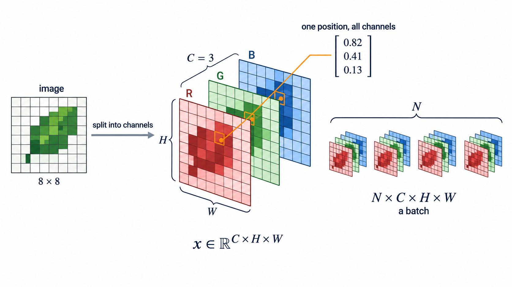
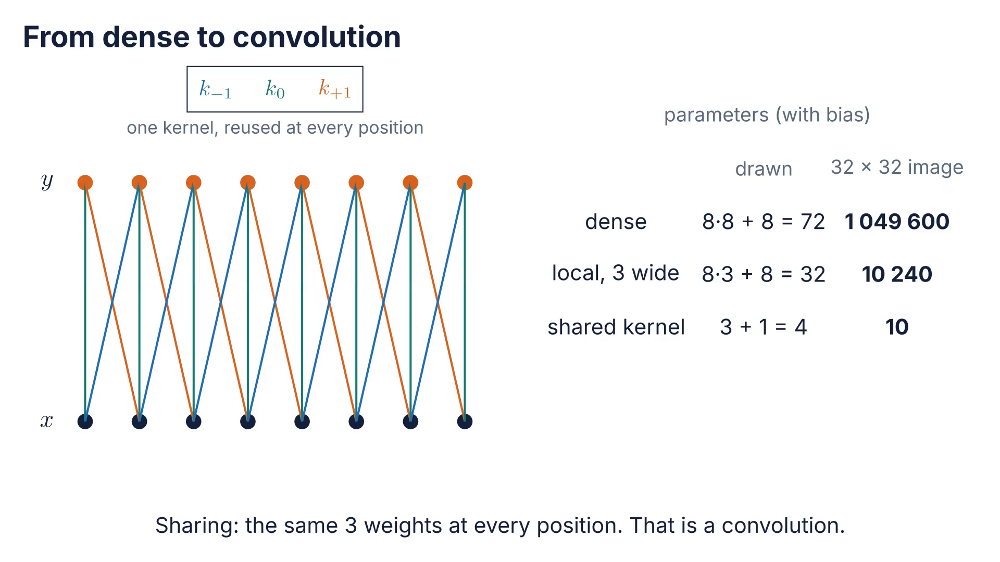
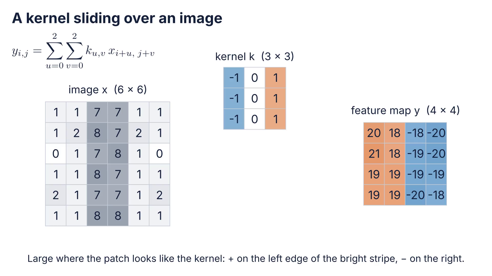
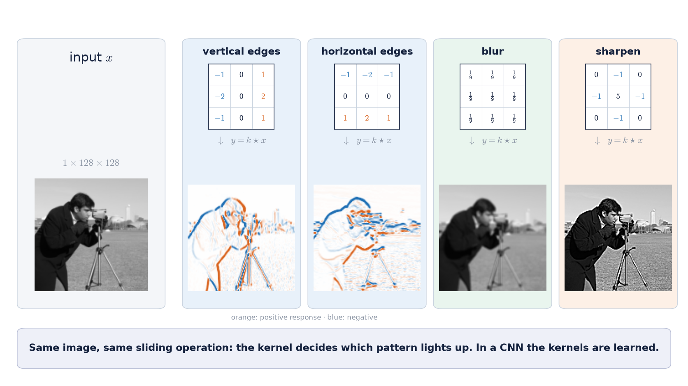
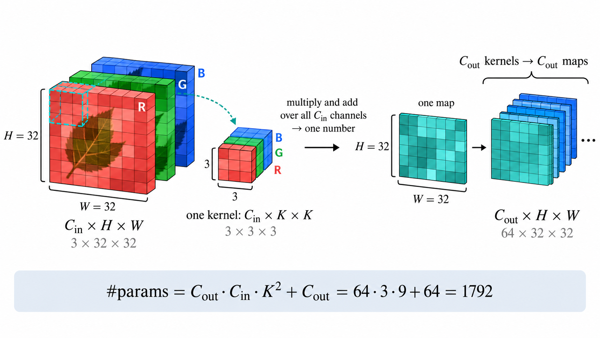
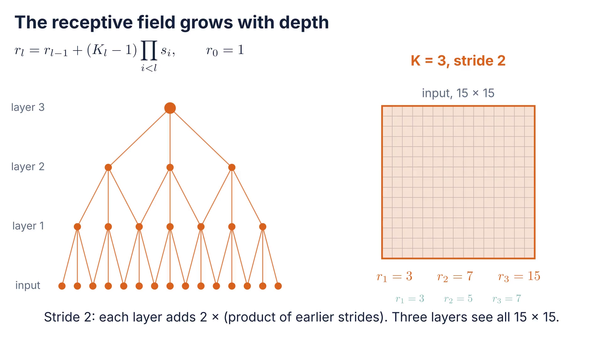
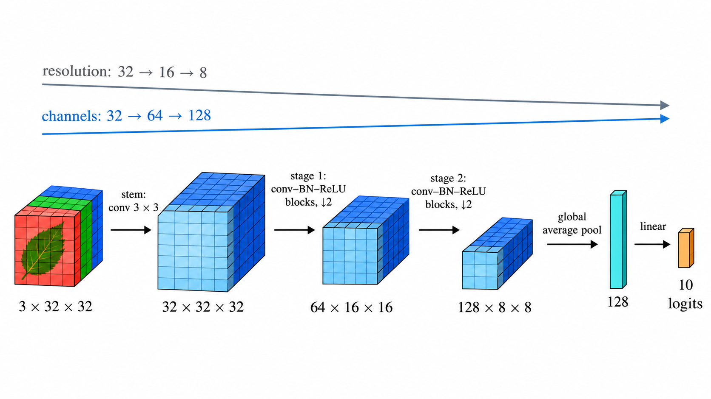
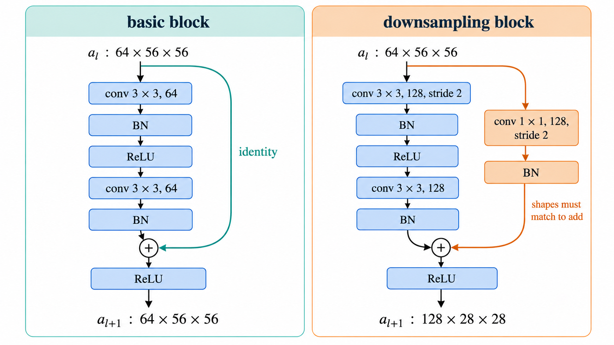
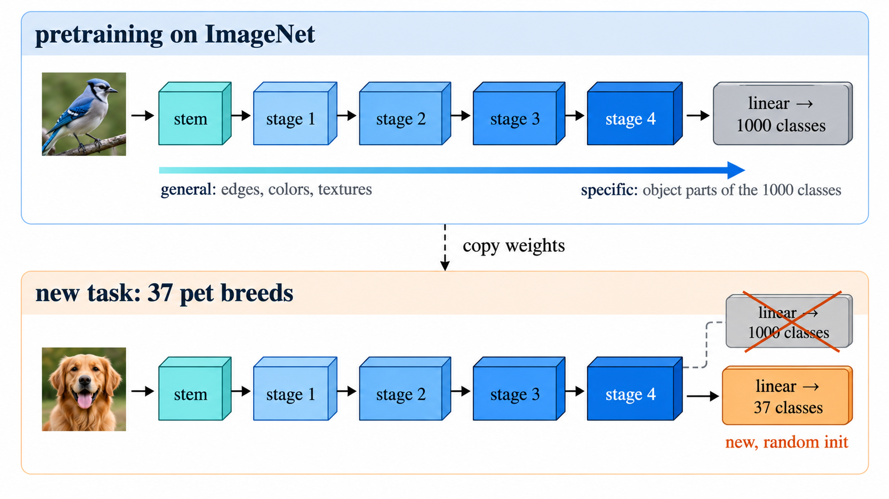
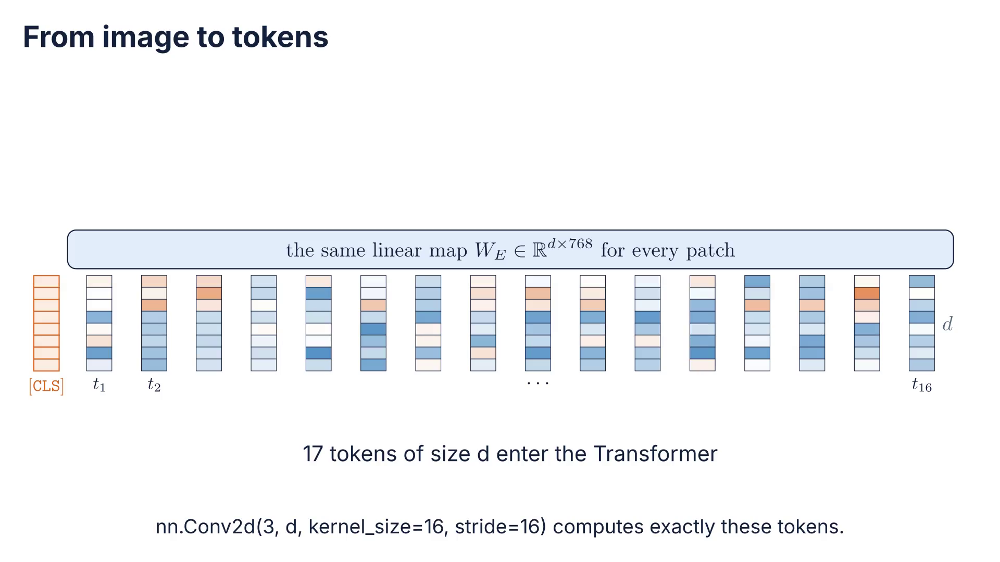

# How does data structure shape the network?

<div class="center">

$$
\text{tensor}
\rightarrow
\text{locality}
\rightarrow
\text{convolution}
\rightarrow
\text{hierarchy}
\rightarrow
\text{transfer}
\rightarrow
\text{patches}
$$

</div>

---

# Roadmap

1. Images are structured data — what an MLP ignores
2. Convolution — locality and weight sharing as a layer
3. CNNs and residual networks — stacking local layers into a hierarchy
4. Transfer learning — reusing features learned on other data
5. From patches to attention — a weaker assumption, more data

Each part names one **assumption** about images and shows the evidence for when it helps.

---

# From deep training to architecture

Session 02 asked whether a deep $f_\theta$ **can be trained**.

Session 03 asks **which** $f_\theta$ to train.

$$
x
\rightarrow
\underbrace{f_\theta(x)}_{\text{now with structure}}
\rightarrow
\hat y
\rightarrow
L
\rightarrow
\nabla_\theta L
\rightarrow
\theta'
$$

The loop, the optimizers and the diagnostics stay the same.

---

# The question for today

> **What assumption does this architecture introduce, and what evidence shows whether that assumption helps in this problem?**

An architecture is a bet about the data.

A good bet saves parameters and data. A wrong bet costs accuracy that no optimizer can recover.

---

# Part 1 · Images are structured data

1. **Images are structured data** — what an MLP ignores
2. Convolution — locality and weight sharing as a layer
3. CNNs and residual networks — stacking local layers into a hierarchy
4. Transfer learning — reusing features learned on other data
5. From patches to attention — a weaker assumption, more data

> Session 02: we can train deep networks. Now: what should they look like?

---

# An image is a tensor

A color image is a 3-D array:

$$
x \in \mathbb{R}^{C \times H \times W},
\qquad
C = 3\ (\text{RGB})
$$

A batch adds one dimension: $N \times C \times H \times W$.

Values are usually scaled to $[0,1]$ and then normalized **per channel**.

---

<!-- _class: figure -->
<!-- _paginate: false -->
<!-- _footer: "" -->



---

# Flattening an image into an MLP

CIFAR-10: $3 \times 32 \times 32 = 3072$ inputs.

A first hidden layer with 512 units has

$$
3072 \times 512 + 512 \approx 1.6\ \text{M parameters}
$$

For a $224 \times 224$ image the same layer needs about **77 M** parameters.

---

# What flattening discards

After `flatten`, the MLP sees a vector of 3072 numbers.

Nothing tells it that pixel 1 and pixel 2 are **neighbors**, or that pixel 1 and pixel 33 are **one row apart**.

Every input position gets its own weights: a pattern learned in one corner must be learned again in the others.

---

# Prediction before experiment

Choose one fixed random permutation $\pi$ of the 3072 positions.

Apply it to **every** image, in training and in test.

<div class="twocol">

<div>

**MLP** trained on permuted images:

accuracy goes up, down, or stays the same?

</div>

<div>

**CNN** trained on permuted images:

accuracy goes up, down, or stays the same?

</div>

</div>

<!-- Pending figure S03-F02 (full-slide figure after this slide): permutation experiment: original vs permuted images; MLP and CNN accuracy on each (measured in notebook 3.1) -->

---

# Two assumptions about images

**Locality.** Nearby pixels are strongly related; distant pixels much less.

**Translation equivariance.** A pattern means the same thing wherever it appears: an edge is an edge in any corner.

An MLP assumes neither. A convolutional layer assumes both.

---

# Dense, local, shared

For a $32 \times 32$ single-channel input mapped to a $32 \times 32$ output:

| Layer | Each output sees | Parameters |
|---|---|---:|
| Dense | all 1024 inputs | $\approx 1\,050\,000$ |
| Locally connected, $3\times3$ | 9 neighbors, own weights | $\approx 10\,200$ |
| Convolution, $3\times3$ | 9 neighbors, **shared** weights | $10$ |

Locality removes most connections; sharing removes most of the rest.

---

<!-- _class: media -->

# From dense to convolution

<video controls preload="none" poster="../figures/s03_a01_dense_to_conv_poster.png" aria-label="From dense to convolution">
  <source src="../figures/s03_a01_dense_to_conv.mp4" type="video/mp4">
</video>


[Open animation](../figures/s03_a01_dense_to_conv.mp4)

<!-- 8 inputs, 8 outputs: dense (72 parameters) → local (32) → one shared kernel (4); for a 32×32 image 1 049 600 → 10 240 → 10. Answers the table on the previous slide. -->

---

# Part 2 · Convolution

1. Images are structured data — what an MLP ignores
2. **Convolution** — locality and weight sharing as a layer
3. CNNs and residual networks — stacking local layers into a hierarchy
4. Transfer learning — reusing features learned on other data
5. From patches to attention — a weaker assumption, more data

> Part 1: the MLP ignores neighborhoods; locality and sharing reduce 1 M parameters to 10.

---

# Convolution as a sliding dot product

A kernel $k \in \mathbb{R}^{K \times K}$ slides over the image:

$$
y_{i,j}
=
b
+
\sum_{u=0}^{K-1}
\sum_{v=0}^{K-1}
k_{u,v}\,
x_{i+u,\;j+v}
$$

Deep learning libraries compute this cross-correlation and call it convolution. The kernel is learned, so the flip does not matter.

---

<!-- _class: media -->

# A kernel sliding over an image

<video controls preload="none" poster="../figures/s03_a02_kernel_sliding_poster.png" aria-label="A kernel sliding over an image">
  <source src="../figures/s03_a02_kernel_sliding.mp4" type="video/mp4">
</video>


[Open animation](../figures/s03_a02_kernel_sliding.mp4)

<!-- Vertical-edge kernel [-1 0 1] on a 6×6 image with a bright stripe; first position worked out (sum = 20), then the full 4×4 map: + on the left edge, − on the right. -->

---

# A kernel is a pattern detector

The output is large where the patch **looks like** the kernel.

$$
\begin{bmatrix}
-1 & 0 & 1\\
-2 & 0 & 2\\
-1 & 0 & 1
\end{bmatrix}
\quad
\text{responds to vertical edges}
$$

The result $y$ is a **feature map**: where in the image the pattern occurs.

---

<!-- _class: figure -->
<!-- _paginate: false -->
<!-- _footer: "" -->



---

# Many channels in, many channels out

An RGB input has 3 channels; each kernel spans **all** input channels.

A layer with $C_\text{out}$ kernels produces $C_\text{out}$ feature maps:

$$
W \in \mathbb{R}^{C_\text{out} \times C_\text{in} \times K \times K},
\qquad
\#\text{params} = C_\text{out}\,C_\text{in}\,K^2 + C_\text{out}
$$

`nn.Conv2d(3, 64, kernel_size=3)` → $64 \cdot 3 \cdot 9 + 64 = 1792$ parameters.

---

<!-- _class: figure -->
<!-- _paginate: false -->
<!-- _footer: "" -->



---

# Padding and stride

**Padding** $p$ adds a border so the kernel can sit on edge pixels.

**Stride** $s$ moves the kernel $s$ pixels at a time.

$$
H_\text{out}
=
\left\lfloor
\frac{H + 2p - K}{s}
\right\rfloor
+ 1
$$

$K=3,\ p=1,\ s=1$ keeps the size: the usual choice inside a block.

---

# Prediction before experiment

Input: $64 \times 32 \times 32$.

Layer: `nn.Conv2d(64, 128, kernel_size=3, stride=2, padding=1)`.

1. What is the output shape?
2. How many parameters?
3. Did the number of activations go up or down?

---

# Equivariance

Shift the input, and the feature map shifts by the same amount:

$$
\operatorname{conv}\big(\operatorname{shift}(x)\big)
=
\operatorname{shift}\big(\operatorname{conv}(x)\big)
$$

The layer does not need to learn the same pattern at every position.

Equivariance is exact away from the borders, and stride breaks it partially.

---

# Pooling

Pooling summarizes a neighborhood with one number:

- **max pooling**: is the pattern present anywhere in the window?
- **average pooling**: how much of it is there?

It halves the resolution and gives a small **invariance** to local shifts.

Modern networks often replace pooling with a strided convolution.

---

# Receptive field

The **receptive field** of a unit is the region of the input it depends on.

It grows with depth:

$$
r_l
=
r_{l-1}
+
(K_l - 1)\prod_{i<l} s_i,
\qquad r_0 = 1
$$

Three $3\times3$ layers with stride 1 see $7 \times 7$. Strides make it grow much faster.

---

<!-- _class: media -->

# The receptive field grows with depth

<video controls preload="none" poster="../figures/s03_a03_receptive_field_poster.png" aria-label="The receptive field grows with depth">
  <source src="../figures/s03_a03_receptive_field.mp4" type="video/mp4">
</video>


[Open animation](../figures/s03_a03_receptive_field.mp4)

<!-- Three 3×3 layers without padding: stride 1 gives r = 3, 5, 7; stride 2 gives r = 3, 7, 15. Same formula as the previous slide. -->

---

# 1×1 convolutions

A $1 \times 1$ kernel looks at a single position, across all channels:

$$
y_{:,i,j} = W\,x_{:,i,j} + b,
\qquad
W \in \mathbb{R}^{C_\text{out} \times C_\text{in}}
$$

It is a small MLP applied to every pixel. It mixes channels and changes their number cheaply.

---

# Parameters versus compute

A convolution is cheap in **parameters** but not in **compute**:

$$
\text{FLOPs} \approx 2\,C_\text{out}\,C_\text{in}\,K^2\,H_\text{out}\,W_\text{out}
$$

The same 1792 weights are reused at every one of the $H_\text{out} W_\text{out}$ positions.

This is why CNNs reduce resolution as they add channels.

---

# Part 3 · CNNs and residual networks

1. Images are structured data — what an MLP ignores
2. Convolution — locality and weight sharing as a layer
3. **CNNs and residual networks** — stacking local layers into a hierarchy
4. Transfer learning — reusing features learned on other data
5. From patches to attention — a weaker assumption, more data

> Part 2: a convolution detects one local pattern everywhere; depth grows what each unit sees.

---

# Anatomy of a CNN

$$
\underbrace{\text{stem}}_{\text{first conv}}
\rightarrow
\underbrace{\text{stage}_1 \rightarrow \cdots \rightarrow \text{stage}_S}_{\text{conv–BN–ReLU blocks}}
\rightarrow
\underbrace{\text{global pool}}_{C \times 1 \times 1}
\rightarrow
\underbrace{\text{linear}}_{\text{logits}}
$$

Between stages: **halve** the resolution, **double** the channels.

---

<!-- _class: figure -->
<!-- _paginate: false -->
<!-- _footer: "" -->



---

# A short history in three networks

| Network | Year | Idea that stayed |
|---|---:|---|
| LeNet-5 | 1998 | conv → pool → conv → pool → dense |
| AlexNet | 2012 | ReLU, GPUs, Dropout, augmentation, ImageNet scale |
| VGG | 2014 | only $3 \times 3$ kernels, many of them |

After VGG, the problem became **depth** — the same problem as in Session 02.

---

# Why stacks of 3×3?

Two stacked $3 \times 3$ layers see $5 \times 5$; three see $7 \times 7$.

With $C$ channels in and out:

$$
\underbrace{2 \cdot 9C^2 = 18C^2}_{\text{two } 3\times3}
\quad<\quad
\underbrace{25C^2}_{\text{one } 5\times5}
$$

Fewer parameters, and one extra nonlinearity in between.

<!-- Pending figure S03-F15 (full-slide figure after this slide): VGG-style block (conv3×3–ReLU–conv3×3–ReLU–max pool, no shortcut) with shapes; two stacked 3×3 see 5×5; 18C² vs 25C² -->

---

# BatchNorm in convolutional layers

In Session 02, BatchNorm normalized each feature over the batch.

In a CNN, each **channel** is one feature, so statistics are computed over $N$, $H$ and $W$:

$$
\mu_c = \frac{1}{NHW}\sum_{n,i,j} x_{n,c,i,j}
$$

`nn.BatchNorm2d(C)` has $2C$ learned parameters, whatever the image size.

---

# Global average pooling

Instead of flattening the last feature maps, average each channel:

$$
\bar a_c = \frac{1}{HW}\sum_{i,j} a_{c,i,j}
$$

- far fewer parameters than `flatten` + dense;
- the network accepts any input size;
- each channel acts as a detector whose overall presence feeds the classifier.

---

# A hierarchy of features

Early layers respond to **edges and colors**.

Middle layers respond to **textures and repeated motifs**.

Late layers respond to **object parts**.

Each level is built from local combinations of the level below.

<!-- Pending figure S03-F06 (full-slide figure after this slide): feature hierarchy from the ImageNet-pretrained ResNet-18 used in notebook 3.4: first-layer kernels, then top-activating patches for channels in stages 2, 3 and 4 -->

---

# Residual blocks with convolutions

The residual block from Session 02, now with convolutions:

$$
a_{l+1} = \operatorname{ReLU}\big(a_l + F(a_l)\big),
\qquad
F = \text{conv–BN–ReLU–conv–BN}
$$

When a stage halves the resolution, the shortcut becomes a **$1\times1$ convolution with stride 2** so the shapes match.

---

<!-- _class: figure -->
<!-- _paginate: false -->
<!-- _footer: "" -->



---

# ResNet-18 at a glance

| Stage | Output ($224$ input) | Blocks | Channels |
|---|---|---:|---:|
| stem: $7\times7$ conv, max pool | $56 \times 56$ | — | 64 |
| stage 1 | $56 \times 56$ | 2 | 64 |
| stage 2 | $28 \times 28$ | 2 | 128 |
| stage 3 | $14 \times 14$ | 2 | 256 |
| stage 4 | $7 \times 7$ | 2 | 512 |
| global pool + linear | $1 \times 1$ | — | 1000 classes |

About **11.7 M** parameters — fewer than one dense layer on a $224 \times 224$ image.

---

# Augmentation encodes invariances

Random crops, horizontal flips and color jitter tell the model:

> the label does not change under these transformations.

That is another **assumption**. A horizontal flip is harmless for cats and wrong for digits or text.

Augmentation is applied to training data only.

---

# Practice A — From MLP to ResNet

Worked notebooks on CIFAR-10, one change per cell:

- [3.1 · Images and structure](../notebooks/sesion_03_1_imagenes_estructura.ipynb): tensors, the permutation experiment, MLP vs small CNN
- [3.2 · Convolution](../notebooks/sesion_03_2_convolucion.ipynb): convolution by hand vs `nn.Conv2d`, kernels, shapes, receptive field
- [3.3 · CNNs and residuals](../notebooks/sesion_03_3_cnn_resnet.ipynb): small CNN → + BatchNorm → + residual blocks → + augmentation

> Before each cell: which curve moves, and in which direction?

---

# Part 4 · Transfer learning

1. Images are structured data — what an MLP ignores
2. Convolution — locality and weight sharing as a layer
3. CNNs and residual networks — stacking local layers into a hierarchy
4. **Transfer learning** — reusing features learned on other data
5. From patches to attention — a weaker assumption, more data

> Part 3: a CNN builds a hierarchy of local features; residuals make it deep.

---

# Few labeled images

A real problem rarely has 50 000 labeled images.

With a few dozen per class, a ResNet-18 trained from scratch memorizes the training set.

> Can a network trained on **other** images help with ours?

---

# Features are reusable

Early features (edges, colors, textures) are useful for almost any image.

Late features become specific to the classes of the original task.

So the earlier the layer, the more transferable it is.

---

<!-- _class: figure -->
<!-- _paginate: false -->
<!-- _footer: "" -->



---

# Three strategies

| Strategy | What is trained | Cost | When |
|---|---|---|---|
| From scratch | everything, random init | high | lots of data, unusual domain |
| **Linear probe** | only the new head; backbone frozen | low | little data, similar domain |
| **Fine-tuning** | head + some or all backbone | medium | moderate data, or a domain gap |

<!-- Pending figure S03-F09 (full-slide figure after this slide): the three strategies side by side, frozen layers shaded, trained layers highlighted -->

---

# Linear probe

Freeze the backbone $g$ and train a linear classifier on its features:

$$
\hat y = \operatorname{softmax}\big(W\,g(x) + b\big),
\qquad
g \ \text{fixed}
$$

Features can be computed **once** and cached, so training takes seconds.

Probe accuracy is also a measurement of **representation quality**, which we use again in Session 04.

---

# Fine-tuning

Unfreeze part or all of the backbone, with care:

- a **smaller learning rate** for the backbone than for the new head;
- warmup, so the random head does not wreck pretrained weights in the first steps;
- with small batches, keep BatchNorm statistics **frozen** (`eval` mode) in the backbone.

---

# Match the pretraining preprocessing

The backbone learned on images with a given size and normalization.

```python
weights = ResNet18_Weights.IMAGENET1K_V1
model = resnet18(weights=weights)
preprocess = weights.transforms()   # resize, crop, ImageNet mean/std
```

Mismatched preprocessing is one of the most common silent bugs in transfer learning.

---

# Prediction before experiment

Oxford-IIIT Pets, 37 breeds. Three strategies with ResNet-18:

from scratch · linear probe · fine-tuning

1. With **5 images per class**, which wins?
2. With **all** training images (~100 per class), does the order change?

<!-- Pending figure S03-F10 (full-slide figure after this slide): test accuracy vs images per class for the three strategies (measured in notebook 3.4) -->

---

# When transfer helps less

ImageNet is natural photographs taken from the ground.

Satellite images, X-rays and microscopy look different: the **domain gap** is large.

Early features usually still transfer; late features often do not.

Fine-tuning, rather than a linear probe, recovers part of the gap.

---

# Part 5 · From patches to attention

1. Images are structured data — what an MLP ignores
2. Convolution — locality and weight sharing as a layer
3. CNNs and residual networks — stacking local layers into a hierarchy
4. Transfer learning — reusing features learned on other data
5. **From patches to attention** — a weaker assumption, more data

> Part 4: pretrained features let a strong architecture work with few labels.

---

# The limit of locality

A unit in a CNN sees the whole image only after many layers.

Relating two distant regions — a head and a tail, the two ends of a road — takes depth.

> What if every region could look at every other region in **one** layer?

---

# An image as a sequence of patches

Cut a $224 \times 224$ image into $16 \times 16$ patches:

$$
\frac{224}{16} \times \frac{224}{16} = 14 \times 14 = 196 \ \text{patches},
\qquad
16 \cdot 16 \cdot 3 = 768 \ \text{values each}
$$

Each patch is mapped to a vector of size $d$: a **token**.

---

# Patch embedding is a convolution

Flattening each patch and applying the same linear map is exactly:

```python
nn.Conv2d(3, d, kernel_size=16, stride=16)   # 3×224×224 → d×14×14
```

Then reshape $d \times 14 \times 14$ into a sequence of $196$ tokens of size $d$.

---

<!-- _class: media -->

# From image to tokens

<video controls preload="none" poster="../figures/s03_a04_patches_to_tokens_poster.png" aria-label="From image to tokens">
  <source src="../figures/s03_a04_patches_to_tokens.mp4" type="video/mp4">
</video>


[Open animation](../figures/s03_a04_patches_to_tokens.mp4)

<!-- 64×64 image, 16 patches of 16×16, flattened to 768 numbers, one random W_E (d = 8 for display), plus positional embeddings and the CLS token: 17 tokens. -->

---

# Self-attention, in one slide

Each token becomes a **weighted average of all tokens**. The weights come from how similar the tokens are:

$$
\operatorname{Attention}(Q,K,V)
=
\operatorname{softmax}\!\left(\frac{QK^\top}{\sqrt{d_k}}\right)V,
\qquad
Q = XW_Q,\ K = XW_K,\ V = XW_V
$$

Row $i$ of $X$ is token $t_i$. The weights depend on the **content**, not on a fixed neighborhood.

The full mechanics — heads, masks, cost — come in **Session 05**.

<!-- Pending figure S03-F11 (full-slide figure after this slide): attention map from a pretrained ViT: one query patch and the patches it attends to, over the image -->

---

# Position must be added

Attention compares tokens by content only. Shuffle the tokens, and the outputs are shuffled the same way.

That is the **permutation experiment** of Part 1 again.

So a learned **positional embedding** is added to each token:

$$
t_i = W_E\,\operatorname{patch}_i + p_i
$$

---

# The Vision Transformer

$$
[\texttt{CLS}],\ t_1, \dots, t_{196}
\rightarrow
\underbrace{\big[\text{LN} \rightarrow \text{attention} \rightarrow + \;\rightarrow\; \text{LN} \rightarrow \text{MLP} \rightarrow +\big]}_{\times D \ \text{blocks}}
\rightarrow
\text{head}(\texttt{CLS})
$$

Everything in the block is from Session 02: LayerNorm, residual paths, an MLP.

The new piece is attention.

<!-- Pending figure S03-F12 (full-slide figure after this slide): ViT architecture: patches → embedding + position → CLS token → D pre-norm encoder blocks → head -->

---

# Inductive bias versus data

A CNN **assumes** locality and translation equivariance.

A ViT has to **learn** them from data.

- small data: the CNN's assumptions win;
- very large pretraining: the ViT catches up and then passes the CNN;
- modern CNNs (ConvNeXt) close much of that gap again: the bias is not the whole story.

<!-- Pending figure S03-F13 (full-slide figure after this slide): spectrum of assumptions MLP → CNN → ViT, against the amount of data each needs -->

---

# Prediction before experiment

CIFAR-10, 10 000 training images, same budget of epochs:

1. a small CNN trained from scratch;
2. a small ViT trained from scratch;
3. a pretrained ViT with a linear probe.

Rank them before running.

---

# Practice B — Transfer and attention

- [3.4 · Transfer learning](../notebooks/sesion_03_4_transfer_learning.ipynb) · Oxford-IIIT Pets: from scratch, linear probe and fine-tuning, with 5 to ~100 images per class
- [3.5 · From patches to ViT](../notebooks/sesion_03_5_patches_vit.ipynb) · CIFAR-10: patch embedding, small ViT vs CNN, pretrained ViT

> 3.4 and 3.5 run best with a GPU (Colab or Kaggle).

---

# Integrating exercise — EuroSAT

[3.6 · Integrating exercise](../notebooks/sesion_03_6_integrador_eurosat.ipynb) · Sentinel-2 satellite images, $64 \times 64$, 10 land-use classes, 27 000 images

- choose and justify a strategy: CNN from scratch, linear probe or fine-tuning;
- preprocessing that matches the backbone, augmentation that respects the domain;
- every run logged to **MLflow**; `predict_raw` on new image files.

> Does ImageNet help with images taken from space?

---

# Choosing an architecture

| Data | Labels | First choice |
|---|---|---|
| tabular features | any | MLP or gradient boosting |
| images, few labels | ~10–1000 per class | pretrained CNN or ViT, linear probe → fine-tune |
| images, many labels | $10^3$+ per class | CNN, or ViT with pretraining |
| images, unusual domain | any | fine-tuning; check the gap with a probe |

---

# What each architecture assumes

| | Assumes | Pays with |
|---|---|---|
| MLP | nothing about position | parameters, data |
| CNN | locality, translation equivariance | global context needs depth |
| ViT | almost nothing; position is learned | data or pretraining |

<!-- Pending figure S03-F14 (full-slide figure after this slide): summary: the same image processed by MLP, CNN and ViT, with what each layer can see -->

---

# Exit question

You have 300 labeled chest X-rays in 3 classes.

A colleague proposes a ViT-B/16 trained from scratch.

Choose two and justify:

- linear probe on a pretrained CNN;
- fine-tuning a pretrained CNN;
- training a ViT from scratch with heavy augmentation;
- collecting more labels first;
- checking the domain gap with a probe before fine-tuning.
